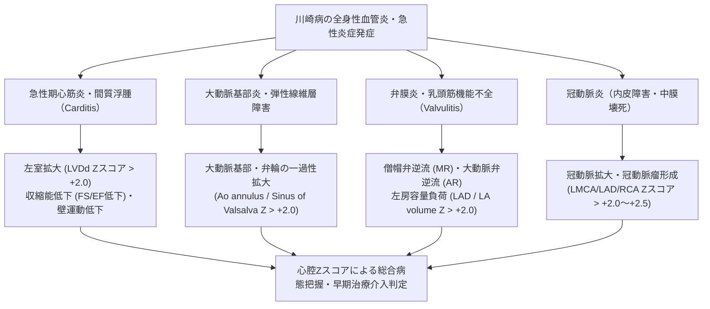
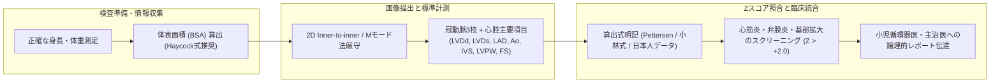

# 小児心エコーにおける心腔計測Zスコアと川崎病評価

---

## 1. はじめに：なぜ小児心エコーで心腔計測にもZスコアが必要なのか

小児循環器領域における超音波検査（心エコー）では、新生児（体重約2～3kg、体表面積 BSA 0.2 m² 前後）から思春期・青年期（体重60kg超、BSA 1.6～1.8 m² 超）に至るまで、患者の体格が劇的かつ非線形に拡大・変化します。成人の心エコーで汎用される「LVDd < 55 mm は正常」といった絶対値基準（固定カットオフ値）を小児領域にそのまま適用することは不可能です。

小児心エコーの黎明期・過渡期においては、「年齢別基準値」「体重あたりのミリ数（mm/kg）」などが用いられた時代もありましたが、成長曲線や体格指数と心臓各構造の拡大率は単純な比例関係（線形関係）ではありません。心腔容積や血管径は、体表面積（Body Surface Area: BSA）に対してアロメトリー式（非線形回帰式）に従って発達します。

この急激な体格変化の中で、真の心拡大・心筋障害・弁輪不均衡・血管拡張を統計学的・客観的に捉える唯一の共通言語が**心腔計測Zスコア（Chamber Z-score）**です。

### 1.1 急激な体格変化とアロメトリー（Allometry）の課題
- **非線形の解剖学的拡大**：心腔径（1次元）や心筋壁厚は、概ね体格の平方根（$BSA^{0.5}$）に比例して発育し、心室容積（3次元）は $BSA^{1.5}$ に比例します。固定値や単純な比率（mm/kg）では、低体重児で過小評価（病的拡大の見落とし）、学童期で過剰診断を生じる致命的欠陥があります。
- **Zスコア（標準偏差スコア）の基本原理**：
  健常小児母集団における体表面積（BSA）と心腔計測値の回帰分析から「予測平均値（Predicted Mean）」と「残差標準偏差（Residual SD または $SD_{model}$）」を数理モデル化し、患者の実測値が健常母集団の平均から標準偏差何個分偏っているかを定量化したものです。
  $$Z = \frac{\text{実測値} - \text{予測平均値}(\text{Predicted Mean})}{\text{標準偏差}(\text{SD})}$$
  正規分布に従う場合、$Z = 0$ が母集団平均値、$-2.0 \le Z \le +2.0$ の範囲に健常児の95.45%が含まれます。したがって、$Z > +2.0$ は「上位2.27%を超える異常拡大」を客観的に意味します。

### 1.2 川崎病診療における心腔Zスコアの決定打
川崎病（Kawasaki Disease: KD）の診療において、心エコーの関心は冠動脈内径（冠動脈瘤の有無）に集中しがちです。しかし、川崎病は本質的に**全身性血管炎・汎心筋炎（Pancarditis）**であり、急性期にはほぼ全例で潜在的または顕在的な心筋炎、心内膜炎、弁膜炎、大動脈炎を合併します。
- 冠動脈瘤が出現する前の超急性期（発病第1～4病日）から、**左室拡大（LVDd Zスコアの上昇）や左室収縮能・拡張能の低下**が出現します。
- 心筋炎による心機能不全やショック（川崎病ショック症候群: KDSS）の兆候を捉えるために、心腔径・壁厚・弁輪径のZスコア評価は不可欠です。



---

## 2. 川崎病における心筋炎・心拡大・弁膜症（MR, AR）の病態評価と心腔Zスコアの臨床的意義

川崎病における心腔病変は、単なる形態異常ではなく、血管炎・心筋炎の炎症強度や循環動態のストレスを直接反映する動的指標です。

### 2.1 急性期心筋炎（Carditis / Myocarditis）と左室パラメータ
1. **左室拡大（LVDd Zスコア > +2.0）**
   - 急性期の心筋生検や病理解剖研究により、川崎病の急性期にはほぼ100%に間質の浮腫、単核球浸潤、心筋線維の変性が生じていることが知られています。
   - 心筋炎に伴うコンプライアンス低下・収縮不全・炎症性拡張により、左室拡張末期径（LVDd）が増大します。
   - 体表面積補正を行わなければ「1歳児でLVDd 31 mm」の病的意義を見落としやすいですが、Zスコアを用いると $Z = +2.6$（明らかな病的左室拡大）と判定でき、急性期心筋炎の合併を鋭敏に検出できます。
2. **左室収縮能低下（FS, EF）と壁運動異常**
   - 左室短縮率（Fractional Shortening: FS）の基準値は小児で約 28～40%（平均 34% 前後）です。急性期心筋炎では FS < 28% あるいは < 25% への一過性低下が認められます。
   - 左室駆出率（EF）の低下（Teichholz法やSimpson法で EF < 55%）や、心尖部・前壁を中心とする全周性または局所性の壁運動低下（hypokinesis）を伴います。
3. **川崎病ショック症候群（KDSS: Kawasaki Disease Shock Syndrome）**
   - 著明な収縮不全、末梢血管拡張（サイトカインストーム）、毛細血管漏出症候群が複合し、心原性ショック・敗血症様ショックを呈する重症病態です。
   - 心エコーでは著明な左室拡大（LVDd Z > +3.0）、高度収縮低下（FS < 20%）、心嚢液貯留（Pericardial effusion）が特徴的です。IVIG不応および冠動脈瘤合併の超ハイリスク群となります。

### 2.2 僧帽弁逆流（MR）・大動脈弁逆流（AR）と左房拡大（LAD / LA volume）
1. **僧帽弁逆流（MR: Mitral Regurgitation）のメカニズム**
   - **弁膜炎（Valvulitis）**：弁尖の炎症・浮腫による接合不全。
   - **乳頭筋機能不全・虚血**：心筋炎の波及や微小冠循環障害による乳頭筋機能不全。
   - **僧帽弁輪拡大（Mitral Annular Dilation）**：左室拡大に伴う弁輪二次性拡大（MV annulus Z > +2.0）。
   - 急性期MRは軽度〜中等度が多く、炎症の消退とともに軽快することが多いですが、腱索断裂や高度MRへ進展する例も存在します。
2. **左房拡大（LAD Zスコア、LA volume Zスコア）の臨床的意義**
   - MRの逆流血液量や左室拡張末期圧（LVEDP）の上昇による容量負荷・圧負荷を反映して、左房（LA）が拡大します。
   - Mモードによる左房前後径（LAD）のZスコア、あるいは2D法（Simpson biplane法）による左房容積（LA volume index）のZスコアを追跡することで、左心不全や充満圧上昇の客観的重症度モニタリングが可能です。
3. **大動脈弁逆流（AR: Aortic Regurgitation）**
   - 急性期〜亜急性期における弁尖の活動性炎症や、後述する大動脈基部・弁輪拡大に伴い生じます。遠隔期まで遺残・進行することがあり、厳重な観察が必要です。

### 2.3 大動脈基部（Ao annulus / Sinus of Valsalva / STJ）の一過性拡大
- **大動脈炎（Aortitis）の病理**：
  川崎病の血管炎は冠動脈に特異的と思われがちですが、実際には全身の中等度〜大動脈に波及します。上行大動脈・大動脈基部（Valsalva洞・STジャンクション）の中膜弾性線維層（elastic lamellae）の破壊と浮腫が生じます。
- **エコー所見**：
  大動脈弁輪（Ao annulus）、バルサルバ洞（Sinus of Valsalva）、洞管接合部（STJ: Sinutubular junction）のZスコアが $+2.0 \sim +4.0$ に達する一過性基部拡大が、急性期川崎病の約10～20%に観察されます。
- **臨床的意義**：
  基部拡大の存在は、炎症が冠動脈周囲の大動脈壁深部にまで強く及んでいることを示唆し、IVIG不応性や重症冠動脈病変合併の予測因子（Surrogate marker）としても注目されています。

---

## 3. 代表的な小児心腔Zスコア算出式と特徴

小児心腔Zスコアには、世界各国の主要研究グループから複数の算出式が提唱されています。母集団の人種、サンプル数、計測手法（Mモード vs 2D）、統計モデリングが異なるため、実務上の特徴を把握して使用することが不可欠です。

### 3.1 主要算出式の比較一覧表

| 算出式・文献 | 対象母集団・症例数 | 計測項目・対象部位 | 計測手法・規格 | 数理モデル・特徴 | 長所と臨床適用上の留意点 |
| :--- | :--- | :--- | :--- | :--- | :--- |
| **Pettersen et al. (2008)**<br>*(J Am Soc Echocardiogr 2008; 21: 922-934)* | カナダ小児<br>$N = 788$<br>(0～18歳) | LVDd, LVDs, IVS, LVPW, LAD, Ao annulus, Sinus, STJ, Asc Ao, MPA, RPA, LPA, MV, TV, PV など全21部位 | 2D法 (Inner-to-inner)<br>ASE小児ガイドライン準拠 | $\ln(\text{径}) = a + b \cdot \ln(\text{BSA})$<br>または非線形回帰。<br>残差分散の異分散性（heteroscedasticity）をBSA依存関数でモデル化 | **現在世界で最も汎用される標準式**。<br>計測部位が網羅的（弁輪・大血管・心室径）。2D Inner edge法に厳密準拠。 |
| **Kampmann et al. (2000)**<br>*(Heart 2000; 83: 667-672)* | ドイツ小児<br>$N = 2,036$<br>(新生児～18歳) | LVDd, LVDs, IVSd, LVPWd, LAD, Ao (Sinus, Annulus) | Mモード法主体<br>(Leading-edge to leading-edge) | 予測値 $= a \cdot \text{BSA}^b$<br>パーセンタイルおよびSD算出 | 症例数が2000例超と極めて大規模。古典的Mモード計測に親和性が高い。乳児から学童まで安定。 |
| **Cantinotti et al. (2014, 2017)**<br>*(J Am Soc Echocardiogr 2014, 2017)* | イタリア小児<br>$N = 1,151$<br>(新生児～17歳) | 心腔径、弁輪径、左室壁厚、心房容積、右室パラメータ | 2D法およびMモード両対応<br>高品質デジタル画像 | 多項式回帰モデルおよびBox-Cox変換による正規化 | 新生児・乳児のデータが充実。最新の2D計測プロトコルに適合。欧州の標準として普及。 |
| **Detroit式 (Chubb et al. / Zilberman et al.)**<br>Children's Hospital of Michigan | 北米小児<br>(多民族) | 左室径、大動脈基部、冠動脈など | 2D法 / Mモード | 非線形アロメトリーモデル | 北米の先天性心疾患センター・オンライン計算サイト（Parameterz.com等）で汎用。 |
| **Boston式 (Colan / Dallaire et al.)**<br>Boston Children's Hospital | 北米小児母集団 | 弁輪径、左室径、壁厚、大血管径 | 2D法中心 | 対数変換パラメトリックモデル | 先天性心疾患（低形成左心症候群や大動脈縮窄症等）の適応決定・術前評価の世界基準。 |
| **日本人小児データ**<br>(国立成育医療研究センター / 小林ら) | **日本人健常小児**<br>多施設共同研究 | LVDd, LVDs, 左室心機能指標、冠動脈径 | 日本超音波医学会 / 小児循環器学会基準 | 日本人小児体格回帰モデル | **日本人小児の体格特性に完全合致**。<br>欧米データに比して体脂肪率や骨格差によるZスコア乖離を起こさない。国内臨床・治験の第一選択。 |

### 3.2 統計モデリングと「異分散性（Heteroscedasticity）」の重要性
小児心腔のZスコア算出式を理解する上で、統計学的な「異分散性」への配慮が極めて重要です。
- 低体重児（BSA 0.2～0.3 m²）では、心腔径のバラつき（標準偏差）は絶対値として小さく（例：$\pm 1.0\,\text{mm}$）、学童期・思春期（BSA 1.5 m²）ではバラつきが大きく（例：$\pm 3.5\,\text{mm}$）なります。
- 単純な線形回帰分析では「全体格で分散が一定」と仮定してしまうため、乳幼児で過小評価、年長児で過大評価を招きます。
- **Pettersen式**や**小林式**などの高精度モデルでは、予測平均値だけでなく、標準偏差自身もBSAの関数（$SD = c \cdot \text{BSA}^d$ など）として数理モデル化されており、新生児期から思春期まで均一な標準偏差判定（Zスコアの信頼性）が保証されています。

---

## 4. 標準計測部位と計測タイミング（ASE/日本小児循環器学会準拠）

心腔計測値をZスコア式に代入する際、**計測断面・境界線の同定法（Leading-to-leading vs Inner-to-inner）・心周期タイミング**が異なると、Zスコア値が容易に $\pm 1.0$ 以上変動します。ガイドラインの規定を厳格に順守しなければなりません。

### 4.1 計測手法の規格比較：Mモード vs 2D法

```
【Leading-edge to leading-edge 法 (ASE古典的Mモード基準)】
  前壁心内膜表面（上縁） ────────────┐ ← 測定開始点（前壁leading-edge）
  心腔（無エコー域）                    │
  後壁心内膜表面（上縁） ────────────┘ ← 測定終了点（後壁leading-edge）
  （※後壁心内膜のエコー厚みが心腔径に含まれる）

【Inner-to-inner 法 (ASE小児2Dガイドライン / Pettersen基準)】
  前壁心内膜内面（下縁） ────────────┐ ← 測定開始点（前壁内境界）
  心腔（無エコー域）                    │ ＝ 真の血液・内膜境界面
  後壁心内膜表面（上縁） ────────────┘ ← 測定終了点（後壁内境界）
  （※心腔内壁間の純粋な内腔スペースのみを計測）
```

1. **Mモード法（Leading-edge to leading-edge）**：
   - 歴史的に成人・小児ともに長年用いられてきた手法（Kampmann式など）。
   - 時間分解能が極めて高く（1,000 fps超）、超高心拍（140～160 bpm）の乳児でも収縮末期・拡張末期のピークを正確に捉えられます。
   - 欠点：ビームが左室長軸に対して斜交（oblique cut）しやすく、過大評価のリスクがある。
2. **2D法（Inner-to-inner 法）**：
   - 現代の小児心エコーガイドライン（ASE Pediatric Guidelines / Pettersen式 / Cantinotti式）の標準。
   - Bモードの胸骨左縁長軸像（PLAX）または短軸像（PSAX）で、左室心尖部や乳頭筋の位置を視覚的に確認しながら、左室短軸に完全に直交する真の径を計測できる。
   - 境界線は**内縁から内縁（Inner-to-inner）**で計測する。

### 4.2 主要部位の計測タイミングと解剖学的ランドマーク

| 計測部位 | 略称 | 推奨断面 | 計測タイミング（心周期） | ランドマークおよび計測規則 |
| :--- | :--- | :--- | :--- | :--- |
| **左室拡張末期径** | **LVDd** | 胸骨左縁長軸像 (PLAX)<br>または乳頭筋レベル短軸 (PSAX) | **拡張末期**<br>(心電図R波ピーク、または僧帽弁閉鎖直後) | 僧帽弁弁尖先端の直下（腱索レベル）。乳頭筋本体は含めない。後壁・中隔の内膜内縁間。 |
| **左室収縮末期径** | **LVDs** | 同上 | **収縮末期**<br>(収縮期後壁最大前方移動点、または大動脈弁閉鎖直前) | 後壁内膜が最も内側に突出し、中隔が最大収縮した瞬間。 |
| **心室中隔厚 / 後壁厚** | **IVSd / LVPWd** | 同上 | **拡張末期** | 中隔の右室側内膜〜左室側内膜、後壁の左室側内膜〜心外膜境界。心外膜の高輝度エコーは除外。 |
| **左房前後径** | **LAD** | 胸骨左縁長軸像 (PLAX) | **収縮末期**<br>(心室収縮末期、大動脈弁閉鎖直前、LA最大径) | 大動脈洞管接合部レベルで大動脈後壁と左房後壁内縁間を直交計測。 |
| **大動脈弁輪径** | **Ao annulus** | 胸骨左縁長軸像 (PLAX) ズーム | **収縮中期**<br>(弁尖最大開放時) | 大動脈弁尖のヒンジポイント（Hinge-to-hinge）、Inner-to-innerで計測。 |
| **バルサルバ洞径** | **Sinus of Valsalva** | 同上 | **拡張末期** | 左右の冠尖バルサルバ洞の最大膨隆部を長軸に直交計測。 |
| **洞管接合部径** | **STJ** | 同上 | **拡張末期** | バルサルバ洞と管状上行大動脈の境界くびれ部。 |
| **主肺動脈幹径** | **MPA** | 胸骨左縁短軸像 (PSAX PA level) | **収縮中期** (肺動脈弁最大開放時) | 肺動脈弁輪直上と左右分岐部の中間点。 |
| **僧帽弁輪径** | **MV annulus** | 心尖部4腔像 (A4C) | **拡張早期〜中期** (弁最大開放時) | 弁尖ヒンジポイント間（Inner-to-inner）。 |
| **下大静脈径** | **IVC** | 剣状突起下（肋骨下）矢状断 | 呼気終末（安静呼吸下） | 右房流入部から約 5～10 mm 尾側。吸気虚脱率（Caval index）を併せて評価。 |

---

## 5. 小児科Drとの実践的対話トークスクリプト（カンファレンス・病棟報告）

川崎病急性期において、検査技師が小児科医・主治医へ心腔計測結果を報告する際は、**単なる測定値の提示にとどまらず、BSA標準化Zスコア、心機能変化、そして全身性血管炎・心筋炎の病態との統合的解釈**を論理的に伝えることが求められます。

### 5.1 【症例1：急性期心筋炎合併の報告】（発病第4病日、1歳2か月女児、体重9.2kg、体表面積 $0.43\,\text{m}^2$）

> **検査技師**：
> 「小児科の〇〇先生、先ほど検査を終えた川崎病第4病日の△△ちゃんのエコー結果についてご報告よろしいでしょうか。冠動脈内径に加えて、**急性期心筋炎を疑う有意な左室拡大と収縮能低下**を認めております。」
> 
> **主治医（小児科Dr）**：
> 「ありがとう。冠動脈瘤はできていなかったかい？心筋炎の所見はどうだった？」
> 
> **検査技師**：
> 「はい、冠動脈については、LAD近位部内径 1.8mm（小林式 $Z = +1.4$）、RCA近位部 1.7mm（$Z = +1.3$）と、現時点で $Z \ge +2.0$ の明らかな冠動脈拡大・瘤形成は認めません。
> しかし、心腔計測において**左室拡張末期径（LVDd）が 31.8 mm、Pettersen式Zスコアで $+2.85$** と著明に拡大しています（同体格の予測平均値は約 25.5 mm）。
> 加えて、**左室短縮率（FS）が 23.8%（前回健常時推定 34%）、Teichholz EF 48.5%** まで低下しており、心尖部から前壁にかけてびまん性の壁運動低下（mild hypokinesis）を認めます。心嚢液は後壁側に微量（深さ 2.5mm）貯留しています。」
> 
> **主治医（小児科Dr）**：
> 「LVDdのZが $+2.8$ 超えでFS 23%か！臨床的にも頻脈と啼泣時の不機嫌が目立っていたんだ。心筋炎による急性左室不全・容量負荷の初期段階だね。僧帽弁逆流（MR）や左房圧はどう？」
> 
> **検査技師**：
> 「カラーフロードプラにて、僧帽弁接合不全に伴う**軽度〜中等度のMR（Jet面積率 約18%）**を認めております。これに伴い**左房径（LAD）も 19.2 mm、Zスコア $+2.3$** と拡大傾向です。急激な心負荷・心筋炎合併と矛盾しない所見です。画像を電子カルテの緊急参照フォルダにアップロードしましたので、IVIG開始前の初期循環評価としてご確認ください。」
> 
> **主治医（小児科Dr）**：
> 「的確な評価をありがとう。冠動脈だけでなくLVDd ZスコアとFSの低下を追跡する必要があるね。IVIG投与中も心不全兆候に注意して循環管理を行い、明日また心エコーでフォローをお願いします。」

---

### 5.2 【症例2：大動脈基部炎・一過性拡大の報告】（発病第6病日、3歳4か月男児、体重14.5kg、体表面積 $0.62\,\text{m}^2$）

> **検査技師**：
> 「〇〇先生、川崎病第6病日で本日IVIG開始予定の◇◇君のエコーです。冠動脈の軽度拡大に加え、**大動脈基部（バルサルバ洞）の一過性血管炎性拡大**を認めております。」
> 
> **主治医（小児科Dr）**：
> 「大動脈基部の拡大？詳しく教えてもらえるかな。」
> 
> **検査技師**：
> 「はい。まず冠動脈ですが、左主幹部（LMCA）が 2.9 mm（小林式 $Z = +2.2$）、LAD近位部が 2.4 mm（$Z = +2.4$）と境界域の拡大（Dilation only）を認めております。
> そして大動脈弁レベルの観察において、**バルサルバ洞（Sinus of Valsalva）最大径が 20.8 mm、Pettersen式Zスコアで $+2.72$**、**大動脈弁輪径（Ao annulus）が 14.5 mm（$Z = +2.35$）**と、いずれも $+2.0$ を有意に超過しています。
> 弁尖そのものには著明な肥厚はありませんが、軽度の大動脈弁逆流（AR, trivial to mild、拡張初期の狭いJet）を認めています。」
> 
> **主治医（小児科Dr）**：
> 「大動脈炎がバルサルバ洞まで波及して、弁輪の拡大からARが出ているのか。血管炎の活動性がかなり強いサインだね。」
> 
> **検査技師**：
> 「おっしゃる通りです。大動脈基部Zスコアの上昇は強い血管炎の波及を示唆し、文献的にもIVIG不応例や冠動脈病変の進行リスクが高い群で有意に多く観察されると報告されています。
> 左室径（LVDd 34.0 mm, $Z = +1.1$）や収縮能（FS 32%）は保たれていますが、基部拡大と冠動脈Zスコアが $2.0 \sim 2.5$ であることから、IVIG投与後の退縮または進行を厳重にフォローするのが望ましいと考えます。」
> 
> **主治医（小児科Dr）**：
> 「非常に重要な指摘をありがとう。不応リスクを念頭に置いて初期治療に入り、第8病日に大動脈基部径と冠動脈径の再検をオーダーします。」

---

## 6. まとめと品質管理チェックリスト

小児心エコーおよび川崎病の心腔評価において、正確な診断と予後管理を行うための技師チェックリストを以下に示します。



### 心腔Zスコア品質管理の鉄則
1. **BSA計算式の統一**：電子カルテや超音波装置のプリセットが「Haycock式」に設定されているか必ず確認する（DuBois式を用いると乳児でBSAが小さくなり、Zスコアが過大評価される）。
2. **断面の垂直性の担保**：長軸像・短軸像において、斜交断面（オブリック）によるLVDdの過大計測を徹底排除する。
3. **Zスコア算出元の明記**：レポートには必ず「Pettersen et al. 2008基準」「小林式基準」等、参照した回帰モデル名を明記する。
4. **冠動脈と心腔の統合評価**：川崎病の心エコーは「冠動脈だけを見る検査」ではない。心筋炎（LVDd Z > +2.0、FS低下）、左房負荷（LAD Z > +2.0、MR）、大動脈炎（Ao Z > +2.0）をパッケージで評価することこそが、小児心エコー専門エージェント・専門技師の真価である。
