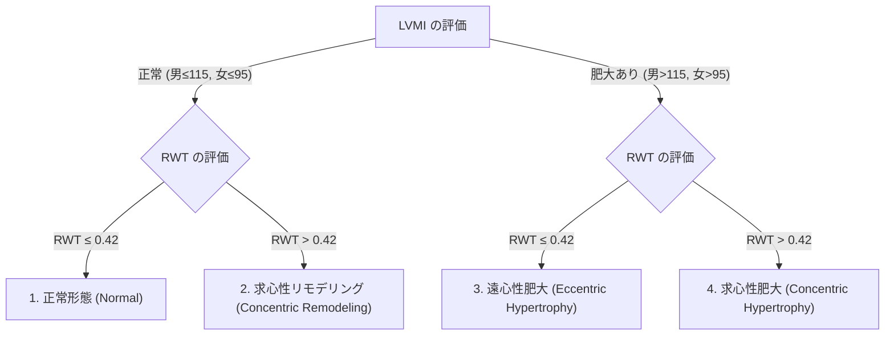

# 左室径と壁厚の計測 (LVDd, LVDs, IVST, PWT)

左室の内径および壁厚の計測は、心拡大、心肥大（LVH）、および左室収縮機能の評価において最も基本的かつ頻用される指標です。

---

## 1. 計測の原則とルール

### 1) 計測断面
- **傍胸骨左室長軸断面 (PLAX)**
  - セオリー: 超音波ビームが左室長軸に対して**垂直**に交差する断面で計測します。
- **傍胸骨左室短軸断面・乳頭筋レベル (PSAX-PM)**
  - PLAXで心室中隔が斜めに切れてしまう場合（高齢者のS字状中隔など）の代替として用いられます。

### 2) リーディング・エッジ法則 (Leading Edge to Leading Edge Rule)
- Mモード計測では、**「Leading edge to leading edge 法則（前縁から前縁へ）」** が原則です。
- 2D像で直接計測する場合は、内膜の輪郭に従う **「Inner edge to inner edge 法則」** または **「Leading edge」** が採用されます（装置の設定・学会基準に準拠）。

```
【Mモード計測における Leading Edge の基本】
  前壁・中隔側 ─────────────┐ (Leading Edge)
     │   IVST (中隔厚)      │
     └──────────────────────┤ (Leading Edge)
         │  LVDd (左室径)   │
         └──────────────────┤ (Leading Edge)
            │  PWT (後壁厚) │
  後壁側 ───┴───────────────┘ (Leading Edge)
```

---

## 2. 計測タイミングと手順

### 1) 拡張末期 (End-Diastole) の計測項目
- **タイミング**: **心電図の QRS波の開始点 (Q波の立ち上がり)**、または僧帽弁が閉鎖した直後のフレーム。
- **計測項目**:
  1. **心室中隔厚 (IVSTd)**: 心室中隔の前縁から後縁まで（右室側内膜から左室側内膜まで）。
  2. **左室拡張末期径 (LVDd)**: 中隔の左室側内膜から後壁の左室側内膜まで。
  3. **左室後壁厚 (PWTd)**: 後壁の左室側内膜から心外膜前縁まで。

### 2) 収縮末期 (End-Systole) の計測項目
- **タイミング**: **左室後壁の後方移動（前進）が最も極大に達する時相（左室径が最も最小となる瞬間）**、または大動脈弁閉鎖直前。
- **計測項目**:
  1. **左室収縮末期径 (LVDs)**: 収縮末期の中隔左室側内膜から後壁左室側内膜までの最大短縮時の内径。

---

## 3. 左室肥大 (LVH) の判定と形態分類

計測された LVDd, IVSTd, PWTd から、左室心筋重量 (LV Mass) および相対的壁厚 (RWT) を算出し、左室のリモデリング様式を分類します。

### 1) 相対的壁厚 (RWT: Relative Wall Thickness) の算出
$$\text{RWT} = \frac{2 \times \text{PWTd}}{\text{LVDd}}$$
- **正常カットオフ値**: **RWT $\le$ 0.42**

### 2) 左室心筋重量係数 (LVMI: LV Mass Index) の算出
Devereux変法による算出:
$$\text{LV Mass (g)} = 0.8 \times 1.04 \left[ (\text{LVDd} + \text{IVSTd} + \text{PWTd})^3 - \text{LVDd}^3 \right] + 0.6$$
$$\text{LVMI} = \frac{\text{LV Mass}}{\text{体表面積 (BSA)}}$$

### 3) 左室肥大・リモデリングの4分類 (ASE/EACVI 2015)




| リモデリング様式 | LVMI (男 / 女) | RWT | 主な基礎疾患・病態 |
| :--- | :---: | :---: | :--- |
| **1. 正常形態 (Normal)** | 正常 (≤ 115 / ≤ 95 g/m²) | ≤ 0.42 | 正常心 |
| **2. 求心性リモデリング** | 正常 (≤ 115 / ≤ 95 g/m²) | **> 0.42** | 早期高血圧、負荷初期 |
| **3. 遠心性肥大 (Eccentric)** | **肥大 ( > 115 / > 95 g/m²)** | ≤ 0.42 | 弁逆流症 (AR/MR), 運動選手心, DCM |
| **4. 求心性肥大 (Concentric)** | **肥大 ( > 115 / > 95 g/m²)** | **> 0.42** | 重症高血圧, 大動脈弁狭窄症(AS), HCM |


---

## 4. ピットフォールと注意点

> [!WARNING]
> **斜め切り (Oblique Cut) による過大評価**
> PLAXにおいて、超音波ビームが左室長軸に対して斜めに入射すると、LVDdやIVSTが実際よりも大きく計測されてしまいます（偽の左室拡大・心肥大）。
> - **対策**: 画面上で大動脈弁と僧帽弁尖がしっかり描出され、左室が最も長く垂直に伸びる断面で計測します。
> 
> **S字状中隔 (Sigmoid Septum) の扱い**
> 高齢者では心室中隔の基部だけが局所的に突出（S字状中隔）することがあります。
> - **対策**: 基部の局所突出部でIVSTを計測すると、肥大型心筋症 (HCM) と誤振してしまうため、**中隔基部から少し心尖部寄りの平坦な部位でIVSTを計測**します。
