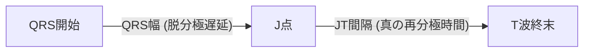

# 04 QT時間とQTc補正計算式 Bazett・Fridericia・Framingham

QT時間は、**心室の電気的脱分極開始（QRS開始点）から再分極完了（T波終止点）までの総時間**を表します。心室筋の活動電位持続時間（Action Potential Duration: APD）を反映する極めて重要なパラメータであり、その延長は致死的多形性心室頻拍である **Torsades de Pointes（TdP）** や心室細動（VF）による突然死に直結します。心拍数（HR）に応じた正しい補正計算式（QTc）の理解と適切な計測法の習得が必須です。

---

## 1. QT時間の定義と接線法（Tangent Method）による計測

QT時間は心拍数によって変動するため、計測精度が診断を左右します。

```mermaid
graph LR
    QRSstart["\"QRS開始点 (Q波またはR波の立ち上がり")"] -->|"QT時間 (ミリ秒 / 秒)"| Tend["\"T波 終末点 (Baselineとの交点")"]
    Baseline["\"PRセグメントまたはTPセグメント (等電位線")"] -.-> Tend
```

### (1) 計測誘導の選択
- 原則として、**全12誘導の中でQT時間が最も長く明瞭な誘導（通常は II誘導 または V5誘導）** を選択します。

### (2) T波終止点の同定：「接線法（Tangent Method）」
T波が基線に戻る境界が不明瞭な場合、国際ガイドラインでは「接線法」の採用が標準化されています。

```mermaid
graph TD
    Method["\"T波終末部の同定法 (接線法")"]
    Method --> Step1["\"① T波のピーク (頂点") を特定"]
    Step1 --> Step2["\"② T波下降脚の最も傾斜が急な部分 (最大傾斜部") に接線を引く"]
    Step2 --> Step3["\"③ その接線が等電位基線 (PR線") と交差する点を『T波終末点』とする"]
```

> [!TIP]
> **U波の取り扱いルール**
> - **独立したU波（T波と明確に分離）**: U波は含めず、T波の終止点までを計測。
> - **T-U融合波（低カリウム血症等）**: T波とU波の間の「最も深いくびれ（Nadir）」を終末点とするか、T波の下降脚に接線を引いてU波成分を切り離して計測します。

---

## 2. 心拍数補正計算式（QTc Formulae）の徹底比較

心拍数が上昇（RR間隔が短縮）するとQT時間は生理的に短縮し、徐脈では延長します。この心拍数依存性を標準化（心拍数 60 bpm / RR間隔 1.0秒時の値に補正）したものが **補正QT時間（QTc）** です。

$$\text{各計算式の比較定義 (単位: QTおよびRRは秒, QTcはミリ秒または秒)}$$

| 計算式名 | 計算フォーミュラ | 長所・特徴 | 短所・注意点 |
| :--- | :--- | :--- | :--- |
| **Bazett 式**<br>(バゼット)<br>【最頻出】 | $$\text{QTc} = \frac{\text{QT}}{\sqrt{\text{RR}}}$$ | ・世界で最も普及<br>・心電図自動診断機の標準<br>・心拍数 60〜80 bpm で良好 | **頻脈（>80 bpm）で過大評価（偽性QT延長）**<br>**徐脈（<60 bpm）で過小評価（偽性正常）** |
| **Fridericia 式**<br>(フリデリシア)<br>【学会推奨】 | $$\text{QTc} = \frac{\text{QT}}{\sqrt[3]{\text{RR}}}$$ | ・**心拍数の影響を最も受けにくい**<br>・新薬治験（ICH E14）や不整脈学会で標準推奨 | 手計算で三乗根（立方根）の計算が必要（関数電卓・アプリ推奨）。 |
| **Framingham 式**<br>(フラミンガム) | $$\text{QTc} = \text{QT} + 0.154(1 - \text{RR})$$ | ・線形回帰モデルに基づく<br>・幅広い心拍数で安定 | 臨床での認知度がBazettより低い。 |
| **Hodges 式**<br>(ホッジス) | $$\text{QTc} = \text{QT} + 1.75(\text{HR} - 60)$$ | ・心拍数（HR）から直接手計算可能 | 極端な頻脈・徐脈で誤差。 |

---

## 3. QTcの正常基準値と危険域（Red Flag）

日本不整脈心電学会およびAHA/ACC/HRSガイドラインに基づくQTc（Bazett補正）判定基準値です。

```mermaid
graph LR
    subgraph QTcRange["QTc基準値 (ミリ秒)"]
        Normal["正常<br>♂ ≤ 450 ms<br>♀ ≤ 460 ms"]
        Borderline["境界域<br>♂ 451〜470 ms<br>♀ 461〜480 ms"]
        Prolonged["\"QT延長 (異常")<br>"♂ > 470 ms<br>♀ > 480 ms\""]
        Critical["\"🚨 危機的延長 (Critical")<br>"QTc > 500 ms<br>(TdP発症超高リスク")"]
    end
    Normal --> Borderline --> Prolonged --> Critical
```

| 区分 | 男性基準値 | 女性基準値 | 臨床的対応・アクション |
| :--- | :--- | :--- | :--- |
| **正常範囲** | $\le 450\text{ ms}$ ($0.45\text{s}$) | $\le 460\text{ ms}$ ($0.46\text{s}$) | 定期観察 |
| **境界域 (Borderline)** | $451 \sim 470\text{ ms}$ | $461 \sim 480\text{ ms}$ | 電解質（K, Mg, Ca）確認、QT延長薬の有無チェック |
| **QT延長 (Abnormal)** | **$> 470\text{ ms}$** | **$> 480\text{ ms}$** | 原疾患精査、原因薬剤の中止検討、ホルター心電図 |
| **危機的QT延長 (Red Flag)** | **$> 500\text{ ms}$（または $\Delta\text{QTc} > 60\text{ ms}$ 延長）** | **$> 500\text{ ms}$（または $\Delta\text{QTc} > 60\text{ ms}$ 延長）** | **🚨 TdP超高リスク！**<br>心電図モニター監視、QT延長薬即時中止、Mg補正 |
| **QT短縮 (Short QT)** | **$< 340\text{ ms}$（$< 360\text{ ms}$）** | **$< 340\text{ ms}$（$< 360\text{ ms}$）** | 先天性短縮QT症候群（SQTS）、高カルシウム血症の精査 |

---

## 4. QTc延長を来す3大成因とリスク因子

```mermaid
graph TD
    Causes["QTc延長の3大成因"]
    Causes --> Genetic["\"① 先天性QT延長症候群 (LQTS")<br>"LQT1 (KCNQ1"), LQT2 (KCNH2), LQT3 (SCN5A)"]
    Causes --> Electrolyte["\"② 電解質異常 (Electrolyte Imbalance")<br>"・低カリウム血症 (Hypokalemia")<br>"・低マグネシウム血症 (Hypomagnesemia")<br>"・低カルシウム血症 (Hypocalcemia")"]
    Causes --> Drugs["\"③ 薬剤性QT延長 (Drug-Induced LQTS")<br>"抗不整脈薬, 抗精神病薬, 抗菌薬, 抗ヒスタミン薬\""]
```

### (1) 代表的なQT延長誘発薬剤一覧

| 薬効群 | 代表的薬剤名 | メカニズム |
| :--- | :--- | :--- |
| **抗不整脈薬** | ・**Ia群**: キニジン、プロカインアミド、ジソピラミド<br>・**III群**: アミオダロン、ソタロール、ニフェカラント | HERGチャネル（$I_{\text{Kr}}$）強力遮断による活動電位持続時間延長 |
| **抗精神病薬** | ・ハロペリドール、クロルプロマジン、スルピリド<br>・クエチアピン、オランザピン、リスペリドン | $I_{\text{Kr}}$ 阻害（静注ハロペリドールは特に高リスク） |
| **抗うつ薬** | ・三環系抗うつ薬（アミトリプチリン等）<br>・SSRI（エスシタロプラム等） | Na/Kチャネル抑制 |
| **抗菌薬・抗真菌薬** | ・マクロライド系（クラリスロマイシン、エリスロマイシン、アジスロマイシン）<br>・ニューキノロン系（レボフロキサシン、モキシフロキサシン）<br>・アゾール系抗真菌薬（フルコナゾール、イトラコナゾール） | $I_{\text{Kr}}$ 遮断 ＋ CYP3A4代謝阻害による血中濃度上昇 |
| **その他** | ・制吐薬（メトクロプラミド、ドンペリドン）<br>・抗ヒスタミン薬 | $I_{\text{Kr}}$ 阻害 |

---

## 5. 脚ブロック・Wide QRS合併時のQT補正（JTc間隔）

完全脚ブロック（CRBBB/CLBBB）や心室ペーシングでは、心室脱分極（QRS幅）そのものが拡大するため、測定される生QT時間およびQTcが必然的に長くなります。



### (1) JT間隔・JTcの算出
脱分極時間（QRS）を差し引き、純粋な心室再分極時間（JT segment）のみを評価します。

$$\text{JT} = \text{QT} - \text{QRS}$$
$$\text{JTc} = \frac{\text{JT}}{\sqrt{\text{RR}}} \quad (\text{正常基準値: } \le 330\text{ ms} \text{ または } \le 0.33\text{s})$$

### (2) 修正QTc計算式（Rautaharjuの式）
$$\text{QTc}_{\text{modified}} = \text{QTc} - 0.5 \times \text{QRS幅}$$

> [!IMPORTANT]
> 完全脚ブロック患者で「真の再分極遅延（LQTS合併）」が存在するかどうかを評価する場合、単純なQTcではなく **JTc $> 330\text{ ms}$** または **$\text{QTc}_{\text{modified}} > 460\text{ ms}$** を指標として用います。

---

## 関連リンク・ナビゲーション
- 前の項目: [[03_ST部_T波_U波の生理と形態変化]]
- 次の章へ: [[01_電気軸の判定法と軸偏位_正常軸_左軸_右軸_極度の軸偏位]]
- 目次に戻る: [[00_心電図デジタル教科書_目次]]
- 関連疾患: [[02_先天性_後天性QT延長症候群_LQTS_LQT1_2_3_TdP]], [[01_高カリウム血症_テント状T波から正弦波まで_低K血症]], [[02_カルシウム異常_高Ca_低Ca_マグネシウム異常]]
