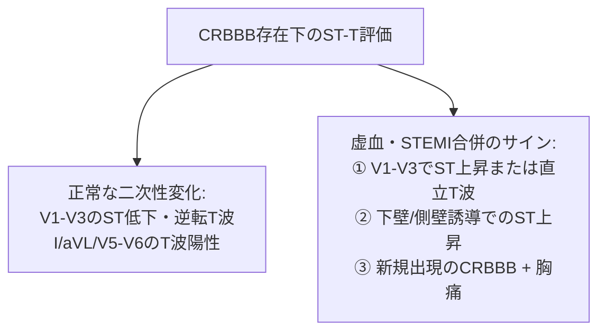

# 01 完全右脚ブロック (CRBBB) と不完全右脚ブロック (IRBBB)

右脚ブロック（Right Bundle Branch Block: RBBB）は、心室刺激伝導系の右脚における伝導途絶または遅延によって生じる室内伝導障害です。健診等で日常的に遭遇する頻度の高い所見ですが、肺塞栓症や心筋梗塞、先天性心疾患などの重大な器質的疾患のサインとなる場合もあります。

---

## 1. 刺激伝導系の解剖と電気生理学的メカニズム

```mermaid
graph TD
    AVN["\"房室結節 (AV node")"] --> His["\"ヒス束 (Bundle of His")"]
    His --> LBB["\"左脚本幹 (Left Bundle Branch")"]
    His --> RBBB_Site["\"右脚 (Right Bundle Branch")<br>"※解剖学的に細長く脆弱\""]
    
    LBB --> Septum["\"心室中隔左室側 (早期脱分極")"]
    Septum --> LV["\"左室遊離壁の興奮<br>(正常伝導: 最初の0.04〜0.08秒")"]
    
    RBBB_Site -.->|伝導ブロック| Block["右脚伝導停止"]
    LV -->|心室心筋経由の遅延伝播| RV["\"右室中隔・右室遊離壁の興奮<br>(遅延伝導: 終末部0.04秒以上遅延")"]
```

### なぜ右脚ブロックが生じやすいか
- **解剖学的特徴**: 右脚は左脚に比べて分岐せず、細長い単一の線維束として心室中隔右側を下行し、心尖部近くの調節帯（moderator band）を通って前乳頭筋・右室壁へ至ります。
- **脆弱性**: このため、カテーテル挿入時の機械的刺激、右室圧上昇（急性肺塞栓症や肺高血圧）、心筋炎、加齢性変性（Lenègre病）などにより容易に伝導障害をきたします。

### 心室興奮の伝播ステップ
1. **初期興奮（中隔脱分極: 正常）**: 左脚が無傷であるため、刺激は通常通り心室中隔の左側から右側へと伝播します（V1誘導の小さな初期r波、I/V6誘導の小さな初期q波を形成）。
2. **中期興奮（左室脱分極: 正常）**: 左室心筋が正常な刺激伝導系（プルキンエ線維）を介して急速に脱分極します（V1のS波、I/V6のR波を形成）。
3. **終末期興奮（右室脱分極: 遅延伝導）**: 右室の興奮は、左室から心室中隔・心筋細胞間を介してゆっくりと遅延伝播します。この遅れた右室脱分極ベクトルが**右前方**へ向かうため、V1誘導で幅広く高い二次上昇（R'波）、I/aVL/V5/V6誘導で幅広く深い終末部S波を形成します。

---

## 2. 心電図診断基準

```mermaid
graph LR
    ECG["右脚伝導障害の判定"] --> QRS_Check{"QRS幅の計測"}
    QRS_Check -->|QRS ≥ 0.12秒 (120ms)| CRBBB["\"完全右脚ブロック (CRBBB")"]
    QRS_Check -->|0.10秒 ≤ QRS < 0.12秒| IRBBB["\"不完全右脚ブロック (IRBBB")"]
    
    CRBBB --> Feature1["\"V1/V2: rsR', rSR', 結節状R波 (ウサギの耳")"]
    CRBBB --> Feature2["\"I, aVL, V5, V6: 幅広い終末部S波 (幅≥0.04s")"]
    CRBBB --> Feature3["\"V1/V2: 二次性ST-T変化 (ST低下・T波陰転")"]
```

### 完全右脚ブロック（CRBBB）の確定基準
| 項目 | 心電図所見・基準値 | 詳細メカニズム・ポイント |
| :--- | :--- | :--- |
| **QRS幅** | **≥ 0.12 秒 (120 ms)** | 記録速度25mm/sで3小マス以上。 |
| **右側胸部誘導 (V1, V2)** | **rsR'、rSR'、M型パターン** (M-shaped QRS)<br>または幅広いノッチを伴うR波 | いわゆる「ウサギの耳（rabbit ears）」。R'波の高さはr波より高くなることが多い。 |
| **左側誘導 (I, aVL, V5, V6)** | **幅広く鈍重な終末S波** (幅 ≥ 0.04秒) | 左室から遠ざかる遅延右室興奮ベクトルを反映。 |
| **心室興奮時間 (VAT)** | **V1誘導で > 0.05 秒** | 右室側の脱分極完了の遅延を反映（V5/V6のVATは正常 ≤0.04秒）。 |
| **二次性ST-T変化** | **V1〜V3で ST低下 および 陰性T波** | 遅延した脱分極に伴う再分極順序の乱れ。病的虚血がなくても必発。 |

### 不完全右脚ブロック（IRBBB）の診断基準
- **QRS幅**: **0.10秒以上 0.12秒未満**（100〜119 ms）。
- **波形形態**: V1/V2誘導で rsR'、rSR' または終末部ノッチ、I/V6誘導で軽度の終末部S波遅延を認めるが、QRS幅が完全右脚ブロックの基準に達しないもの。
- **臨床背景**: 若年者・やせ型・アスリートの生理的変異、心房中隔欠損症（ASD）、右室拡張・右室負荷の初期など。

---

## 3. 二次性ST-T変化と虚血（STEMI）合併時の判読ルール

> [!IMPORTANT]
> **CRBBB存在下における心筋梗塞（STEMI）の診断ルール**
> - **CRBBB単独**: V1〜V3でST低下・陰性T波を呈するのが正常（二次性ST-T変化）。
> - **CRBBBに前壁STEMIが合併した場合**: 本来ST低下しているはずのV1〜V4で **「ST上昇」** または **「陽性T波（擬似正常化）」** が出現する。
> - **CRBBBは左室自由壁の脱分極初期ベクトル（中隔q波など）をマスクしない**ため、左脚ブロックと異なり、**異常Q波やST上昇の判読が比較的容易**です。



---

## 4. 鑑別診断：V1誘導で rSR' / R波増高を呈する病態

| 鑑別疾患 | 心電図特徴 | 鑑別のキーポイント |
| :--- | :--- | :--- |
| **Brugada症候群** | V1〜V3でcoved型/saddle-back型ST上昇（≥2mm）と陰性T波 | J点上昇が顕著。終末S波がI/aVL/V6で目立たない。[[01_Brugada症候群_Type1_2_3_coved型_saddle_back型]] |
| **右室肥大 (RVH)** | V1で高い単相性R波（R/S > 1.0）、著明な右軸偏位 | QRS幅は通常<0.12s。I/aVFで右軸偏位（>+90°）を伴う。[[04_右室肥大_RVH_および両室肥大の心電図基準]] |
| **後壁心筋梗塞** | V1〜V3で高い対称性R波、ST低下、高尖T波 | Reciprocal change（鏡面像）。後背部誘導（V7-V9）でST上昇。[[01_ST上昇型心筋梗塞_STEMI_責任冠動脈枝の同定と誘導局在]] |
| **WPW症候群 (A型)** | V1で幅広R波、短PQ間隔（<0.12s）、デルタ波 | デルタ波による立ち上がり初期の緩徐なスロープ。[[03_WPW症候群と副伝導路_Kent束局在診断]] |
| **漏斗胸 / 電極高位装着** | V1/V2で軽度rSr'パターン | P波が陰性化、第2肋間での過剰記録アーチファクト。 |
| **不整脈原性右室心筋症 (ARVC)** | QRS終末部のイプシロン波（ε波）、V1-V3陰性T波 | QRS終了直後の微小心室電位（Epsilon波）。[[03_不整脈原性右室心筋症_ARVC_イプシロン波_短縮QT]] |

---

## 5. 臨床的意義と対応手順

```mermaid
flowchart TD
    Detect["CRBBBの検出"] --> History{"病歴・症状の確認"}
    
    History -->|無症候性・健診発見| CheckOld{"過去心電図との比較"}
    CheckOld -->|変化なし (慢性)| Routine["\"経過観察 (基礎心疾患スクリーニング")"]
    CheckOld -->|新規出現| Echo["\"心エコー検査 (ASD, 肺高血圧, 右室拡大の除外")"]
    
    History -->|急性胸痛・呼吸困難・ショック| Urgent["\"🚨 緊急精査・ACS / 急性肺塞栓症 (PE")"]
    Urgent --> PE_Check["造影CT / 心エコー / D-dimer / 冠動脈造影"]
```

> [!WARNING]
> **新規出現のCRBBBを見逃すな！**
> 突然の胸痛・呼吸困難に伴って新たに出現したCRBBB（特に $S_I Q_{III} T_{III}$ パターンや右側胸部T波陰転化を伴う場合）は、**急性肺塞栓症（肺動脈主幹部閉塞）** による急性右室負荷の重大サインです。直ちに酸素投与・バイタル安定化・造影CTまたは心エコーを実施してください。

---

## 6. レポート記載例

### 健診・無症候性の場合
```text
【心電図所見】
洞調律 68bpm、QRS幅 132ms。
V1誘導にて rsR' パターン（ウサギの耳様形態）、I, aVL, V5, V6誘導にて幅広く鈍重なS波を認める。
V1-V2誘導に二次性ST低下・T波陰転化を認める。

【診断】
完全右脚ブロック (Complete Right Bundle Branch Block: CRBBB)
（※明らかな急性虚血性ST変化なし。既往・過去心電図と対比の上、症状なければ定期フォロー推奨）
```

### 心房中隔欠損症（ASD）や急性肺塞栓を疑う場合
```text
【心電図所見】
洞性頻脈 108bpm、電気軸 +115° (右軸偏位)。
QRS幅 110ms、V1誘導にて rSR' パターン、III誘導にてQ波および陰性T波、I誘導にて深いS波を認める (S1Q3T3パターン)。

【診断】
不完全右脚ブロック (IRBBB)、右軸偏位、S1Q3T3パターン
【推奨コメント】
急性右室負荷所見を認めます。急性肺塞栓症や右心負荷疾患（ASD、肺高血圧症等）を考慮し、緊急心エコー・D-dimer計測・造影CT等の精査を推奨します。
```

---

## 関連リンク（Obsidian WikiLinks）
- [[00_心電図計測基準値_クイックリファレンス]] - QRS幅・各間隔の正常値
- [[02_完全左脚ブロック_CLBBB_と不完全左脚ブロック]] - 左脚ブロックとの対比・Sgarbossa基準
- [[03_左脚前枝ブロック_LAFB_と左脚後枝ブロック_LPFB]] - 分枝ブロックの合併
- [[04_2枝ブロック_3枝ブロックと室内伝導遅延_IVCD]] - CRBBB+分枝ブロックの臨床的意義
- [[01_上室期外収縮_PAC_と変行伝導]] - 右脚ブロック型変行伝導の機序
