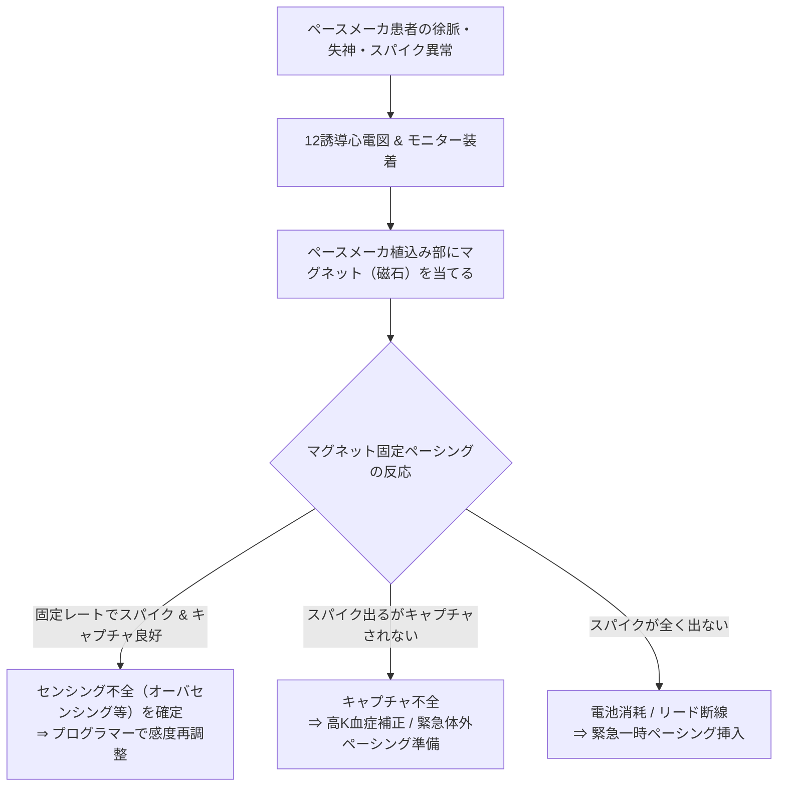

# ⚠️ ペースメーカ不全の鑑別（センシング不全・ペーシング不全）

ペースメーカ不全は、患者のめまい・失神や致死的不整脈（R-on-TによるVF等）に直結する重大なトラブルです。心電図波形から**センシング不全（アンダード/オーバ）** と **ペーシング不全（キャプチャ不全/出力不能）** を迅速に鑑別する手順を解説します。

---

## 1. ペースメーカ不全の全体分類

```mermaid
graph TD
    A["ペースメーカ不全の分類"] --> B["\"① センシング不全 (Sensing Failure")"]
    A --> C["\"② ペーシング不全 (Pacing Failure")"]
    
    B --> B1["\"アンダードセンシング (過小認識")<br/>自己波形を無視してスパイク乱発"]
    B --> B2["\"オーバセンシング (過剰認識")<br/>ノイズやT波を誤認してペーシング抑制"]
    
    C --> C1["\"キャプチャ不全 (Capture Failure")<br/>スパイクはあるがQRS/P波が出ない"]
    C --> C2["\"出力不能 (Output Failure")<br/>本来出るべきスパイクそのものが出ない"]
```

---

## 2. センシング不全の波形と鑑別

### ① アンダードセンシング（Undersensing: 感知不全 / 過小感知）
ペースメーカが自己の心電図電位（P波やQRS波）を「低すぎる」と判断して認識できず、**自己拍動を無視して設定周期通りにスパイクを出力（非同期ペーシング・競合）** してしまう状態です。

```
【アンダードセンシング波形（自己波形を無視してスパイク衝突）】
         ▲ 自己QRS
        / \           │ (自己QRS直後に無関係にスパイク出現)
    ---'   \__   ┌────┴────┐ (R-on-Tの危険!)
                 │         │
                 │         \
                 │          \_______
```

- **心電図特徴**: 自己P波やQRS波の直後やT波の上など、**不適切なタイミングでペーシングスパイクが突然出現**する。
- **最大のリスク**: スパイクが自己拍動のT波頂点付近に落ちる **R-on-T現象** $\to$ 心室細動（VF）の誘発。
- **主な原因**:
  1. **感度設定値が高すぎる（数値が大きい＝感度が鈍い）** 例: 心室感度が5.0mVに設定されている。
  2. リード先端の微小位置ずれ・脱落（Dislodgement）。
  3. 自己心筋電位の低下（心筋梗塞、線維化、高K血症）。

---

### ② オーバセンシング（Oversensing: 過剰認識）
自己の脱分極波（P/QRS）以外の微小電位（T波、P波、胸筋筋電図、電磁ノイズ、リード断線による擦れノイズ）を「自己心室興奮」と誤認し、**ペーシング出力を不適切に抑制（Inhibit）** してしまう状態です。

```
【オーバセンシング波形（不適切な長い休止期 Pause）】
         ▲ 自己QRS
        / \     (T波をQRSと誤認)
    ---'   \___/\________
                         (ペーシングが出ず長い休止期・心停止) ───►
```

- **心電図特徴**: 設定された下限レート（LRL）の間隔を超えても**スパイクが出力されず、予期せぬ長い休止期（Pause）** が出現する。
- **臨床症状**: 突然の眼前暗黒感、めまい、Adams-Stokes発作（失神）。
- **主な原因**:
  1. **感度設定値が低すぎる（数値が小さい＝感度が敏感すぎる）** 例: 心室感度が0.5mVに設定されている。
  2. **T波オーバセンシング（TWOS）**: 巨大なT波をQRSと誤認。
  3. **筋電図オーバセンシング（Myopotential oversensing）**: 胸筋に力を入れた際（腕立て伏せ、重い荷物を持つ等）に抑制。
  4. **リード被覆破損・導線断線ノイズ（Make-break noise）**。

---

## 3. ペーシング不全の波形と鑑別

### ① キャプチャ不全（Capture Failure: ペーシング捕捉不全）
ペースメーカから電気スパイクは正常に出力されているものの、**心筋が興奮閾値に達せず、スパイクの直後に脱分極波形（P波やQRS波）が追従しない**状態です。

```
【キャプチャ不全波形（スパイクの後にQRSが出ない）】
             │ (スパイク出力)
          ┌──┴──┐
       ───┘     └─────────────────────── (心筋が反応せず平坦)
```

- **心電図特徴**: スパイクは等間隔で出ているが、**P波やWide QRS波が全く出現しない（無効スパイク）**。
- **主な原因**:
  1. **ペーシング閾値の上昇**: 急性心筋梗塞・虚血、高度な高カリウム血症、抗不整脈薬（Ia群、Ic群）の血中濃度上昇。
  2. **出力設定不足**: 電圧（V）やパルス幅（ms）の設定が閾値未満。
  3. **リード先端の心筋穿孔（Perforation）や脱落**。

---

### ② 出力不能（Output Failure: スパイク完全消失）
本来スパイクが出るべきタイミングにおいて、スパイク信号そのものが全く出力されない状態です。

- **心電図特徴**: 自己調律が下限レート以下に低下しているにもかかわらず、**ペーシングスパイクが1本も記録されない**。
- **主な原因**:
  - ジェネレータの電池消耗（EOL: End of Life / ERI: Elective Replacement Indicator）。
  - リード完全断線、コネクタ接続部の緩み・外れ。
  - 重度のオーバセンシング（筋電図や外来ノイズによる連続抑制）。

---

## 4. ペースメーカ不全 鑑別クイックマトリックス

| トラブル病態 | スパイクの有無 | スパイクのタイミング | 心筋の反応 (P/QRS) | 最重要チェック項目 |
| :--- | :---: | :--- | :---: | :--- |
| **アンダードセンシング** | **あり** | **不適切（自己波形の直後・上に出現）** | あり / 不応期ならなし | 感度数値を下げる（感度を敏感にする）<br/>リード位置確認 |
| **オーバセンシング** | **なし** | **出ない（設定周期より長く休止）** | なし（休止期） | 感度数値を上げる（感度を鈍くする）<br/>筋電図テスト・リードノイズ確認 |
| **キャプチャ不全** | **あり** | 正常タイミング | **なし（スパイク後に波形が続かない）** | 出力電圧・パルス幅の増大<br/>血清K値・薬剤チェック |
| **出力不能** | **なし** | **全く出ない** | なし（心停止/補充調律） | 電池残量確認<br/>マグネットテスト（固定ペーシング確認） |

---

## 5. ベッドサイドでの緊急対処手順



> [!TIP]
> **マグネット（磁石）テストの威力**
> ペースメーカ不全が疑われる際、植込み部に強力なマグネットを当てると、**センシング回路が遮断され非同期固定ペーシング（DOO/VOOモード）** に切り替わります。
> - オーバセンシングであれば、マグネットを当てた瞬間に固定ペーシングが再開して患者の徐脈・失神が劇的に改善します。

---

## 6. 心電図所見の記載例

```text
【心電図所見】
洞性徐脈 48bpm。
設定レート 60bpmを下回っているにもかかわらず、心室ペーシングスパイクが記録されず、最大3.2秒の休止期（Pause）を認める。
患者に右上肢の力こぶ動作を行わせたところ、連続するペーシング抑制が誘発された。

【診断】
ペースメーカ不全（胸筋筋電図オーバセンシングによる心室ペーシング抑制）

【推奨事項】
ペースメーカプログラマーによる心室感度テストおよび筋電図混入の評価、感度閾値の適正化（感度数値を上げて鈍化）、一時的なマグネット処置の準備。
```

---

## 🔗 関連リンク
- [[00_心電図デジタル教科書_目次]]
- [[01_ペースメーカの基本概念_NBGコード_AAI_VVI_DDD]]
- [[02_ペーシング心電図の基本波形とフュージョンビート]]
- [[04_ICD_CRT_CRT_D_皮下植込み型S_ICDの心電図評価]]
- [[01_心室細動_VF_心室粗動_無脈性心室頻拍_pVT]]
- [[04_見落とし防止!_救急_当直_健診ピットフォールチェックリスト]]
