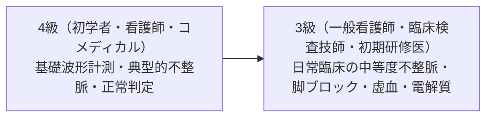

# 🎓 心電図検定 4級・3級頻出パターンと攻略ポイント

心電図検定（JHRS認定）の4級・3級は、**「基礎的な計測ルール」「日常臨床で頻出する代表的不整脈」「虚血・肥大・伝導障害の典型パターン」** を確実に判読できるかが問われます。
本稿では合格基準（約7割得点）を確実に突破するための頻出波形10選と、試験特有のトラップ回避法を徹底整理します。

---

## 1. 4級・3級の出題範囲とレベル基準



| 項目 | 4級（基礎レベル） | 3級（標準レベル） |
| :--- | :--- | :--- |
| **対象** | 医療系学生、心電図初学者 | 病棟・救急看護師、臨床検査技師、初期研修医 |
| **主な出題** | 正常心電図、洞徐脈/頻拍、PAC、PVC、AF、典型STEMI、CRBBB | 3級範囲 ＋ AFL(2:1/4:1)、Wenckebach、CLBBB、WPW、左室肥大、高K血症 |
| **重要度** | 基礎計測値（PQ, QRS, QT）の正確な暗記 | 類似波形の鑑別（AF vs AFL、PAC変行伝導 vs PVC） |

---

## 2. 絶対落とせない頻出パターン10選

### ① 心房細動（AF: Atrial Fibrillation）
- **キーポイント**: **P波の消失** ＋ **基線の不規則な微小動揺（f波）** ＋ **完全なRR間隔不整（絶対的不整）**。
- **検定テクニック**: 長い記録（V1やII誘導）を見て、P波が全くなくRRがバラバラなら直ちにAFと判定。

### ② 心房粗動（AFL: Atrial Flutter）
- **キーポイント**: **規則的な鋸歯状波（F波）**（心房レート約 $250 \sim 300\,\text{bpm}$）。
- **頻出伝導比**:
  - **4:1 伝導**: 心室レート約 $75\,\text{bpm}$（判読容易）
  - **2:1 伝導**: 心室レート約 $150\,\text{bpm}$（**超頻出トラップ！** 下記参照）

### ③ 上室期外収縮（PAC） vs 心室期外収縮（PVC）
- **PAC（期外収縮・上室性）**:
  - 予定より早期に出現する異所性 **$P'$波** ＋ **細いQRS（幅 $<0.10\,\text{秒}$）** ＋ **非代償性休止期**。
- **PVC（期外収縮・心室性）**:
  - 先行P波なし ＋ **幅広く変形したQRS（幅 $\ge 0.12\,\text{秒}$）** ＋ **完全代償性休止期**。
  - **二段脈（Bigeminy）**: 正常拍動とPVCが交互に出現。
  - **三段脈（Trigeminy）**: 正常2拍動ごとにPVCが1拍出現。

### ④ 1度房室ブロック vs 2度房室ブロック（Wenckebach型）
- **1度房室ブロック**: 全てのP波の後にQRSが追従するが、**PQ(PR)時間が一律に $> 0.20\,\text{秒}$（5小マス以上）に延長**。
- **2度房室ブロック（Wenckebach型 / Mobitz I型）**:
  - **PQ時間が拍動ごとに徐々に延長**していき、ついに**P波の後のQRS波が1拍脱落**する（脱落直後のPQ時間は最も短い）。

### ⑤ 完全右脚ブロック（CRBBB） vs 完全左脚ブロック（CLBBB）
- **CRBBB**: $V_1$ で **$rsR'$ パターン（ウサギの耳）** ＋ I, $V_6$ で幅広く浅いS波 ＋ **QRS幅 $\ge 0.12\,\text{秒}$**。
- **CLBBB**: $V_1$ で **深い下向きQS型** ＋ I, aVL, $V_5, V_6$ で **幅広くノッチのあるR波** ＋ **QRS幅 $\ge 0.12\,\text{秒}$**。

### ⑥ WPW症候群（デルタ波）
- **3大特徴**: **短PQ時間（$< 0.12\,\text{秒}$）** ＋ **QRS立ち上がりの緩徐な傾斜（デルタ波）** ＋ **QRS幅の拡大（$\ge 0.11 \sim 0.12\,\text{秒}$）**。

### ⑦ 左室高電位・左室肥大（LVH）
- **Sokolow-Lyon基準**: $S_{V1} + R_{V5} \text{ (または } R_{V6}\text{)} \ge 3.5\,\text{mV}\ (35\,\text{mm})$
- **ストレイン型ST-T変化**: $V_5, V_6$ における非対称性ST低下と陰性T波。

### ⑧ 急性ST上昇型心筋梗塞（STEMI）
- **前壁中隔梗塞**: $V_1 \sim V_4$ の上向き凸ST上昇。
- **下壁梗塞**: II, III, aVF のST上昇 ＋ **I, aVL の対側性ST低下（Reciprocal changes）**。

### ⑨ 異常Q波（陳旧性心筋梗塞: OMI）
- **定義**: **幅 $\ge 0.04\,\text{秒}$（1小マス以上）** または **深さ $\ge R\text{波の } 1/4$**。

### ⑩ 高カリウム血症（テント状T波）
- **特徴**: $V_2 \sim V_5$ で基底部の狭い、**左右対称で高く鋭利に尖ったテント状T波（Tall tented T wave）**。

---

## 3. 3級・4級で絶対に引っかかる頻出トラップと対策

```
【トラップ①: AFL 2:1伝導を見抜く】
心室拍数が「ぴったり 150 bpm」の規則正しい頻拍を見たら、
洞性頻拍やPSVTと即断せず、II, III, aVF, V1の基線をくまなく拡大！
QRS波とT波の中に埋もれた鋸歯状波（F波: 300bpm周期）を探す！
```

```
【トラップ②: PAC変行伝導 vs PVC】
幅広QRSが出現したとき、直前のT波の背中をよく見る！
T波の形が他の洞性拍動のT波と異なって尖っていれば、
「隠れた異所性P'波」が存在する ⇒ 『PACの心室内変行伝導』が正解！
```

### よくある間違いと正解の鑑別表

| 問題の波形 | よくある誤答 | 正しい診断名 | 決め手となる判読ポイント |
| :--- | :--- | :--- | :--- |
| 心拍数 150bpm の規則的頻拍 | 洞性頻拍 / PSVT | **心房粗動（AFL 2:1）** | II・III・aVFで等間隔（300/min）のF波がQRS/T波に重なっている |
| 幅広QRSの期外収縮 | 心室期外収縮（PVC） | **PAC心室内変行伝導** | 幅広QRSの直前のT波に先行異所性P'波が乗っている |
| 不規則なRR間隔 | 心房細動（AF） | **洞性不整脈（呼吸性）** | 全てのQRSの前に正常洞性P波が1:1で規則正しく存在する |
| V1で $rSr'$ 型（QRS幅 0.10秒） | 完全右脚ブロック | **不完全右脚ブロック** | QRS幅が $0.12\,\text{秒}$ 未満（$0.10 \sim 0.11\,\text{秒}$）にとどまる |
| II, III, aVF でQ波あり | 陳旧性下壁梗塞 | **正常亜型（III単独Q波）** | IIやaVFに異常Q波がなく、深吸気でIIIのQ波が消失する |

---

## 4. 試験本番の合格時短テクニック

1. **第1問〜最後の問題まで、まず「心拍数・調律」を最速で判定する**:
   - RR間隔が「太枠何マスか」を一瞬でカウント（太枠2マスなら150bpm、3マスなら100bpm）。
2. **選択肢から逆引きチェックする**:
   - 選択肢に「心房粗動」「WPW症候群」「高カリウム血症」があれば、即座に該当所見（F波、デルタ波、テント状T）の有無を確認。
3. **電位（高さ）のスケールマーク（校正波）を確認する**:
   - 標準感度（10mm = 1.0mV）か、1/2感度（5mm = 1.0mV）かを最初に見る（左室高電位の見誤りを防ぐ）。

---

## 🔗 関連リンク
- [[00_心電図デジタル教科書_目次]]
- [[00_心電図計測基準値_クイックリファレンス]]
- [[01_心電図システマティック5ステップ判読フロー]]
- [[03_心電図検定_2級_1級_マイスター頻出難問と鑑別テクニック]]
- [[04_見落とし防止!_救急_当直_健診ピットフォールチェックリスト]]
