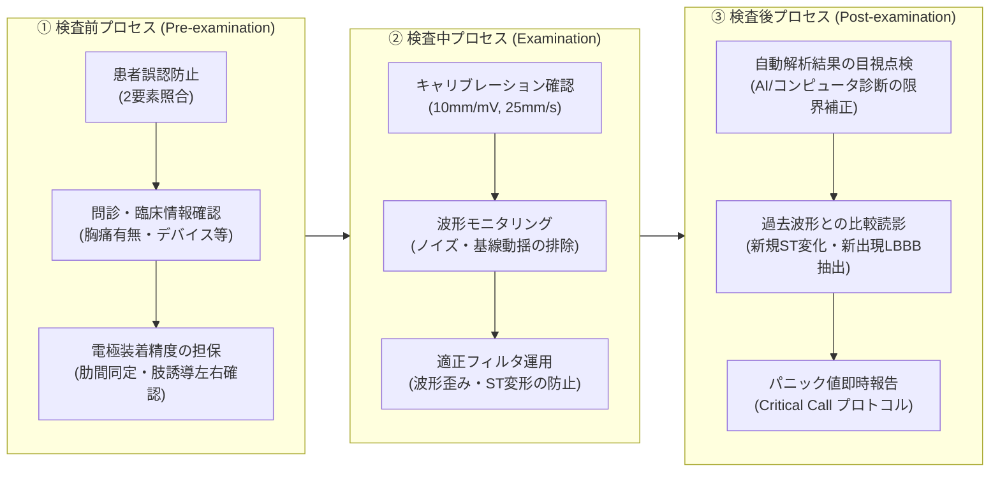

# 13.1 心電図精度管理の全体像とISO 15189

## 📌 なぜ心電図検査で「精度管理（品質マネジメント）」が必要なのか？

検体検査（生化学・血液・免疫等）における精度管理はコントロール血清を用いた「測定値の正確さ・再現性（CV値等）」の数値管理が確立していますが、**心電図などの生理機能検査では「生体を対象とする一回性の検査」であるため、同一検体を再測定することができません。**

そのため、心電図検査における精度管理は**「検査前（Pre）」「検査中（Examination）」「検査後（Post）」の全プロセスを通じた品質保証（Quality Assurance: QA）および品質マネジメントシステム（QMS）**として構築することが国際標準（ISO 15189）で義務付けられています。

> [!IMPORTANT]
> ### 現場の「意見の食い違い」を防ぐ3層構造
> 心電図の精度管理で意見がバラバラになる原因は、論じているレイヤーが異なるためです。
> 1. **機器・設備レイヤー**: JIS/IEC規格に基づく機器の電気的・機械的性能（1mV校正、時定数、周波数特性、アース）
> 2. **技術・手技レイヤー**: 電極装着精度（左右逆付け防止、肋間同定）、ノイズ対策（筋電図・交流障害）
> 3. **判読・運用レイヤー**: 自動解析過信防止、過去比較、パニック値緊急連絡、SOP（標準作業手順書）遵守

---

## 🏛️ ISO 15189:2022に基づく心電図検査プロセス管理

ISO 15189（臨床検査室 — 品質と能力に関する要求事項）のフレームワークに沿って、心電図検査の各ステージを体系化します。

---

## 📋 ISO 15189で求められる主要管理項目一覧

| 管理領域 | ISO 15189 要求事項 | 心電図検査室における具体的実践内容 | 主な指標・根拠規格 |
| :--- | :--- | :--- | :--- |
| **機器・試薬管理** | 検査機器の適格性評価・保守 | ・始業点検・終業点検チェックリスト ・校正信号（1mV=10mm）、紙送り速度（25mm/s）検証 ・誘導コード導通確認、電極清掃・劣化管理 | JIS T 0601-2-25 IEC 60601-2-25 |
| **手技・プロセス管理** | 検査前・中・後の手順標準化 | ・SOP（標準作業手順書）の整備と定期改訂 ・電極誤装着防止のダブルチェック体制 ・アーチファクト抑制プロトコル | JAMT 生理検査標準化ガイドライン |
| **要員の能力・教育** | 従事者の適格性評価と継続教育 | ・心電図判読スキルの定期ブラインドテスト ・心電図検定・認定資格取得の推奨 ・インシデント/ヒヤリハットカンファレンス | 技師会精度管理サーベイ 院内スキルマップ |
| **報告・安全管理** | タイムリーかつ正確な結果提供 | ・自動解析エラーの修正義務化 ・緊急報告（パニック値）基準の設定と伝達記録 ・過去記録との照合手順の義務化 | 医療安全管理指針 Critical Value Protocol |
| **内部・外部質評価** | 検査室の客観的品質評価 | ・内部精度管理（月次エラー率集計、手技監査） ・外部精度管理調査（日臨技・都道府県サーベイ）参加 | EQA（外部精度評価）報告書 |

---

## ⚠️ 精度管理が不十分な場合に生じる医療リスク

1. **肢誘導の左右逆装着**:
   - 右手と左手の逆装着により「偽陰性（本来の梗塞・不整脈の見落とし）」や「偽右軸偏位・偽心筋梗塞」による不要なカテーテル検査や過剰投薬が発生。
2. **胸部電極の位置ズレ（肋間の誤認）**:
   - V1/V2を高位（第2・第3肋間）に装着すると、偽性Brugada型波形や偽性不完全右脚ブロックが出現。
   - 低位に装着すると、移行帯の偏位や前壁梗塞の偽陰性・偽陽性を招く。
3. **過度な筋電フィルタ使用**:
   - 筋電ノイズを消すためにフィルタ遮断周波数を25Hzや15Hzまで下げると、**QRS波のR波高が低下し、急性心筋梗塞のST上昇が平坦化・減衰**して見逃される重大事故が発生する。
4. **自動解析結果の無批判な信認**:
   - 粗動波（F波）を洞調律と誤認する、スパイクのないペースメーカ波形を脚ブロックと誤認するなど、機械判定の盲点をヒトがチェックしないことによる医療事故。

---

## 🎯 まとめ・次章への展開

心電図の精度管理は、**「正しい機械で、正しい位置に電極を貼り、ノイズのない状態で記録し、人間の目で厳密に確認して迅速に医師へ届ける」**という一連のシステム全体を管理することです。

次章以降では、各プロセスの具体的基準・点検手法・判定基準を詳述します。
- [[13_02_機器管理と日常_定期点検_JIS規格]] - 機器のハードウェア点検・JIS規格・校正
- [[13_03_検査前プロセス_電極装着位置と誤装着エラー]] - 肋間同定・誤装着の見分け方
- [[13_04_検査中プロセス_アーチファクトとフィルタ管理]] - ノイズ鑑別とフィルタの歪みリスク
- [[13_05_検査後プロセス_自動解析過信防止と比較読影_パニック値]] - 判読チェック・Critical Call
- [[13_06_内部外部精度管理とSOP_教育体制]] - サーベイ参加と標準作業手順書
