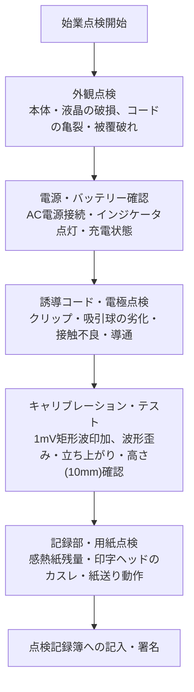

# 13.2 機器管理と日常・定期点検（JIS T 0601-2-25 / 医療法対応）

## 📌 心電計に求められるJIS/IEC規格要件

心電計は微弱な生体電気信号（約0.1〜5mV）を精密に増幅・記録する医療機器であり、**JIS T 0601-2-25（医用電気機器 — 心電計の基礎安全及び基本性能に関する個別要求事項）**および**IEC 60601-2-25**に厳格に準拠している必要があります。

### 主要な基本性能仕様
1. **校正感度（標準感度）**:
   - $1\text{ mV} = 10\text{ mm}$（許容誤差: $\pm 5\%$以内）
   - 感度切替機能（1/2感度: $5\text{ mm/mV}$、2倍感度: $20\text{ mm/mV}$）
2. **紙送り速度（記録速度）**:
   - 標準 $25\text{ mm/s}$（許容誤差: $\pm 5\%$以内）、高速 $50\text{ mm/s}$
3. **時定数（低域遮断特性）**:
   - **$\ge 3.2\text{ 秒}$**（$-3\text{ dB}$時：カットオフ周波数 $f_c \le 0.05\text{ Hz}$）
   - ※時定数が短いと、ST部分が過大に低下（偽陰性・偽陽性のST変化）して正確な虚血診断が不可能になる。
4. **高域周波数応答**:
   - **$150\text{ Hz}$以上**（診断用標準心電図において $-3\text{ dB}$以内）
5. **同相信号除去比（CMRR: Common Mode Rejection Ratio）**:
   - **$\ge 100\text{ dB}$**（交流ハムノイズを除去する性能）
6. **内部雑音（機器ノイズ）**:
   - $\le 30\ \mu\text{V}_{p-p}$
7. **電気的安全（漏れ電流）**:
   - 患者漏れ電流（装着部タイプCF形）: 正常状態 $\le 10\ \mu\text{A}$、単一故障状態 $\le 50\ \mu\text{A}$

---

## 🛠️ 日常点検（始業・終業点検）プロトコル

毎日の検査開始前および終了時に検査技師・実施者が実施すべき必須チェックリストです。

### 日常点検チェック表

| 点検区分 | 点検項目 | 合格基準（正常） | 異常時の対応・リスク |
| :--- | :--- | :--- | :--- |
| **外観** | 本体・液晶・コネクタ | 破損、汚れ、ネジの緩みがないこと | 破損時は使用中止、修理依頼 |
| **誘導コード** | 患者ケーブル・リード線 | 断線、被覆の裂け、断線ノイズがないこと | 屈曲時にノイズが発生する場合はリード線交換 |
| **電極部** | 肢用クリップ / 胸部吸引電極 / ディスポ電極 | 銀-塩化銀（Ag/AgCl）面の剥離・サビ・ゴム球の亀裂がないこと | 接触不良・基線動揺の原因となるため即時交換・清掃 |
| **校正波形** | 1mV校正矩形波の出力 | ・高さが正確に $10\text{ mm}$ ($\pm 0.5\text{ mm}$) ・角が直角でオーバーシュートがないこと | 感度不良時はメーカー校正 |
| **用紙/プリンタ** | ロール紙・印字部 | 用紙残量十分、黒バーの汚れ・カスレなし | サーマルヘッド清掃、用紙補充 |
| **日付・時刻** | 内部時計の精度 | 病院標準時（電波時計/NTP）と秒単位で一致 | 時計ズレは救急・ACS発症時刻の重大な証拠不整合を招く |

---

## 📅 定期点検（月次・年次点検）プロトコル

臨床工学技士（ME/CE）または認定メーカーサービスによる定期保守点検項目です。

### 1. 電気的安全性試験（JIS T 0601-1 / JIS T 0601-2-25）
- **接地線抵抗**: $\le 0.1\ \Omega$（保護接地コード付き機器）
- **外装漏れ電流**: 正常状態 $\le 100\ \mu\text{A}$、単一故障状態 $\le 500\ \mu\text{A}$
- **患者漏れ電流（CF形装着部）**:
  - 直流: $\le 10\ \mu\text{A}$（正常） / $\le 50\ \mu\text{A}$（単一故障）
  - 交流: $\le 10\ \mu\text{A}$（正常） / $\le 50\ \mu\text{A}$（単一故障）
- **除細動器耐量試験**: 除細動器ショック（5kV）印加後、5秒以内に正常記録に復帰すること

### 2. 精度測定試験（心電計テスター / シミュレータ使用）
- **振幅直線性試験**: $0.5\text{ mV}$, $1.0\text{ mV}$, $2.0\text{ mV}$ 入力時の振幅誤差（$\le \pm 5\%$）
- **紙送り速度精度**: $25\text{ mm/s}$, $50\text{ mm/s}$ 連続走行時の時間軸誤差（$\le \pm 5\%$）
- **時定数測定**: 直流ステップ信号印加後、波高が $36.8\%$（$1/e$）まで減衰する時間が $3.2\text{ 秒}$ 以上であること
- **周波数特性試験**: $0.05\text{ Hz} \sim 150\text{ Hz}$ の周波数応答カーブ確認

---

## 🚨 機器トラブルシューティング早見表

| 症状 | 原因の鑑別 | 現場での対処法 |
| :--- | :--- | :--- |
| **特定の1誘導のみ波形が出ない（フラット）** | 該当誘導の電極外れ、またはリード線断線 | ・電極の装着状態・導電ペースト確認 ・予備リード線への交換 |
| **全誘導に $50\text{ Hz}/60\text{ Hz}$ ハムが混入** | アース不良、周囲の大型医療機器（電気毛布、ベッドモータ、点滴ポンプ） | ・電源プラグのアース接地確認 ・周囲の不要なAC機器の電源OFF / 距離を離す |
| **波形が全体的にギザギザ（微細ノイズ）** | 電極の乾燥、皮膚角質抵抗高値、患者の寒冷戦慄 | ・アルコール綿/専用ペーストでの皮膚前処理再実施 ・保温（毛布） |
| **波形が上下に大きく揺れる（基線動揺）** | 呼吸性体動、吸引電極の陰圧不足・ずり落ち | ・電極の再装着・固定 ・リラックスした呼気位での記録 |
| **校正波が丸まる（角がない）** | 高域フィルタ過度設定、または時定数異常 | ・フィルタ設定を「診断用（150Hz）」に戻す ・改善しない場合は機器修理 |
