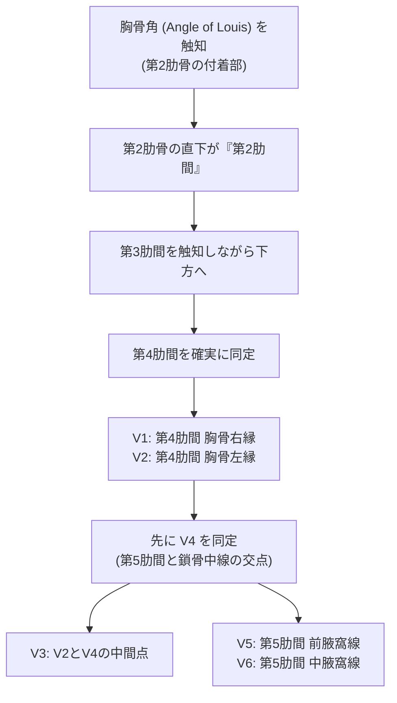

# 13.3 検査前プロセスの品質管理（Pre-examination）— 電極装着精度と誤装着エラー

## 📌 検査前プロセスの重要性

心電図検査の誤診・インシデントの約**70%以上**は、機器の故障ではなく**「患者誤認」および「電極装着のミス・位置ズレ」という検査前（Pre-examination）段階で発生**しています。
ISO 15189では、これらのヒューマンエラーを組織的・構造的に排除する手順（SOP）の確立を求めています。

---

## 👤 患者誤認防止プロトコル（2要素照合）

1. **能動的確認（フルネーム・生年月日）**:
   - 技師が名前を呼ぶだけでなく、患者自身に「お名前（氏名）」と「生年月日（またはID）」をフルネームで名乗ってもらう。
2. **バーコード/リストバンド照合**:
   - 入院患者および救急患者では、リストバンドのバーコードリーダー読み取りを必須とする。
3. **臨床情報・事前確認**:
   - 胸痛・動悸等の現在の症状の有無（現在進行形の虚血発作か否か）
   - ペースメーカ / ICD / CRT 植込みの有無
   - デキストロカルディア（右胸心）の既往有無
   - 前回の心電図記録の有無

---

## 🎯 胸部誘導の解剖学的位置同定（肋間同定エラーの防止）

胸部電極の位置ズレ（特に1〜2肋間のズレ）は、**偽性の心筋梗塞、偽性脚ブロック、偽性Brugada型波形**を容易に引き起こします。



### ⚠️ 胸部電極位置ズレによる典型的ピットフォール

| 位置ズレの種類 | 発生機序・手技ミス | 発生する偽性心電図変化 | 臨床的誤診リスク |
| :--- | :--- | :--- | :--- |
| **V1/V2の高位装着（第2・第3肋間）** | 胸骨角の数え間違い、女性の乳房下縁の安易な基準化 | ・V1/V2のr'波出現（偽性不完全右脚ブロック）<br>・V1/V2のST上昇・サドルバック型出現 | **偽性Brugada症候群**と誤診<br>不要な精密検査・カテ検査 |
| **V1/V2の低位装着（第5・第6肋間）** | 腹部方向への過度な下がり | ・P波・QRS波の平坦化<br>・前壁中隔のQSパターン形成 | **陳旧性前壁梗塞（OMI）**と誤診 |
| **V4〜V6の高位・低位装着** | 第5肋間の水平ラインを維持せず鎖骨中線・腋窩線を無視 | ・移行帯の時計回転/反時計回転の異常<br>・側壁誘導のST-T変化修飾 | 左室肥大・虚血性変化の見落とし・過剰診断 |
| **女性の乳房上への装着** | 乳房の上に電極を装着（減衰・浮き） | ・左胸部誘導（V4〜V6）の顕著な低電位 | 心膜液貯留・心筋症・肥満と誤認 |

> [!TIP]
> **乳房の正しい扱い方**:
> 女性患者では、乳房を持ち上げて**「乳房下縁の胸壁（第5肋間）」**に電極を装着するのが国際標準手技です。

---

## 🔄 四肢電極の付け間違いパターンと瞬時見分け方

四肢電極の付け間違いは、波形が劇的に変化するため、技師・判読医が**「波形の矛盾」を即座に見抜くダブルチェック眼**を持つ必要があります。

```
     [右手: 赤 (RA)] -------- [左手: 黄 (LA)]
            \                   /
             \      心臓       /
              \               /
     [右足: 黒 (RL)] -------- [左足: 緑 (LL)]
```

### 1. 右手（RA: 赤）と左手（LA: 黄）の逆装着（最頻出・重要）

- **発生頻度**: 誤装着の中で最も多い。
- **波形変化の特徴**:
  - **I誘導が完全に上下反転（逆転）**: P波が陰性、QRS群が下向き（QSパターン）、T波が陰性になる。
  - **aVRとaVLが入れ替わる**: 通常陰性のaVRが陽性波形になり、aVLが下向きになる。
  - **II誘導とIII誘導が入れ替わる**。
  - **胸部誘導（V1〜V6）は正常**（胸部誘導は不変）。
- **見分けの黄金律**:
  > **「I誘導でP波・QRSが下向き、かつ aVRで上向き（陽性P-QRS）なのに、胸部誘導（V1〜V6）のrS→qR推移が正常」**であれば、100% 右手・左手逆装着！
  > （※真の右胸心では胸部誘導もV1からV6に向かって減衰する）

---

### 2. 左手（LA: 黄）と左足（LL: 緑）の逆装着

- **波形変化の特徴**:
  - **III誘導が上下反転（極性逆転）**。
  - **I誘導とII誘導が入れ替わる**。
  - **aVLとaVFが入れ替わる**。
  - **aVRは変化しない**。
- **見分けのポイント**:
  > 通常、P波の高さは「II誘導 ＞ I誘導」であるが、逆転して**「I誘導 ＞ II誘導」となり、III誘導のP-QRSが下向き**になる。

---

### 3. 右手（RA: 赤）と左足（LL: 緑）の逆装着

- **波形変化の特徴**:
  - **II誘導が上下反転（完全逆転）**。
  - **I誘導とIII誘導が入れ替わり、かつ上下反転する**。
  - **aVRとaVFが入れ替わる**。
- **見分けのポイント**:
  > 通常最も明瞭で陽性であるべき**II誘導が、P波・QRSともに深い陰性波形**となる。

---

### 4. 誤装着パターンの比較一覧表

| 誤装着パターン | I 誘導 | II 誘導 | III 誘導 | aVR | aVL | aVF | 胸部誘導 |
| :--- | :--- | :--- | :--- | :--- | :--- | :--- | :--- |
| **正常記録** | 正常陽性 | 最大陽性 | 陽性/平坦 | **強陰性** | 陽性/平坦 | 陽性 | 正常推移 |
| **右手(RA) ⇄ 左手(LA)** | **完全反転 (陰性)** | IIIと置換 | IIと置換 | **陽性化 (aVLと置換)** | aVRと置換 | 不変 | 不変 |
| **左手(LA) ⇄ 左足(LL)** | IIと置換 | Iと置換 | **完全反転 (陰性)** | 不変 | aVFと置換 | aVLと置換 | 不変 |
| **右手(RA) ⇄ 左足(LL)** | 反転IIIと置換 | **完全反転 (陰性)** | 反転Iと置換 | aVFと置換 | 不変 | aVRと置換 | 不変 |
| **右足(RL: アース) 誤接続** | 基準電位喪失により、関連誘導が直線（フラット）または極端な低電位・ノイズ化 | - | - | - | - | - | - |
