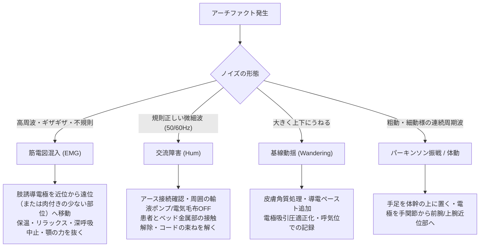

# 13.4 検査中プロセスの品質管理（Examination）— アーチファクトとフィルタ適正管理

## 📌 検査中プロセスの核心：原波形の忠実再現

心電図検査中に最も発生しやすい品質劣化要因は**「ノイズ（アーチファクト）の混入」**と、それを消そうとして行う**「過度なフィルタ処理による波形の歪み」**です。
ISO 15189およびAHA/ACC/HRS国際推奨では、**「まず物理的・手技的にノイズを除去し、フィルタへの過度な依存を避ける」**ことが大原則とされています。

---

## ⚡ 主要アーチファクトの鑑別と物理的除去プロトコル



### アーチファクトの鑑別と対処一覧表

| ノイズの種類 | 周波数帯域 | 発生原因 | 現場での物理的対策 | 誤診リスク |
| :--- | :--- | :--- | :--- | :--- |
| **筋電図混入（EMG）** | $5 \sim 500\text{ Hz}$ | 患者の緊張、寒冷戦慄、力み、開口・会話 | ・室温調整（毛布掛布）<br>・「口を半開きにして顎の力を抜く」よう指示<br>・手足をベッドに預け脱力 | 心房細動（細動波: f波）や心室粗細動と誤診 |
| **交流障害（Hum）** | $50\text{ Hz} / 60\text{ Hz}$ | 商用電源の静電誘導・電磁誘導、アース不良、周囲機器 | ・心電計のアース接地<br>・コードとAC電源線の平行交差を避ける<br>・点滴ポンプ・電気マットの一時停止 | 心房粗動（鋸歯状波: F波）や心房頻拍と誤診 |
| **基線動揺（Wandering）** | $\le 1\text{ Hz}$ | 深呼吸、電極の浮き、皮膚インピーダンス不均一 | ・皮膚のアルコール清拭・角質処理<br>・電極の再装着<br>・安静呼気位での短時間記録 | ST上昇・ST低下の過剰判定・計測エラー |
| **振戦（Tremor）** | $4 \sim 8\text{ Hz}$ | パーキンソン病、本態性振戦、アルコール離脱 | ・電極を振戦の大きい手足の末梢から**「体幹部・上腕・大腿近位部」**へ移動装着 | 心室頻拍（VT）や心房細動と誤認 |

---

## 🎛️ フィルタ設定の適正基準と歪みリスク（重要）

心電計には複数のフィルタ機能が搭載されていますが、**カットオフ周波数を安易に下げることは「波形の改変」に直結します。**

### 1. 診断用心電図の標準フィルタ設定（AHA/ACC/HRS推奨）

- **高域遮断フィルタ（筋電フィルタ）**: **$150\text{ Hz}$ 以上**（小児・新生児では $250\text{ Hz}$ 推奨）
- **低域遮断フィルタ（ドリフト/基線動揺フィルタ）**: **$0.05\text{ Hz}$ 以下**（時定数 $\ge 3.2\text{ 秒}$）
- **交流フィルタ（ハムフィルタ）**: $50\text{ Hz}$ または $60\text{ Hz}$（ノッチフィルタ）

---

### 2. フィルタによる波形歪みのピットフォール

```
【正常診断帯域: 0.05 - 150 Hz】  ──── 鋭いR波、正確なSTレベル、明瞭なペーシングスパイク
                  ▼ 筋電フィルタ (25-35 Hz) を安易にONにすると...
【低帯域制限: 0.05 - 25 Hz】     ──── R波が丸まり波高低下 (偽低電位)、ST上昇が平坦化 (STEMI見落とし)
```

> [!CAUTION]
> ### 筋電フィルタ（35Hz/25Hz）使用時の重大警告
> 1. **R波高の減衰**: QRS波のピークが削られ、左室肥大（LVH）の診断基準を満たさなくなったり、低電位と誤診される。
> 2. **ST変化の減衰**: 急性心筋梗塞（STEMI）の**ST上昇が平坦化**され、緊急カテーテル適応が見逃される危険がある。
> 3. **ペースメーカ・スパイクの消失**: パルス幅の狭いペーシングスパイク（数ミリ秒）が完全にカットされ、自己調律かペーシング調律か判別不能になる。

> [!WARNING]
> ### 基線ドリフトフィルタ（0.5Hz等）使用時の警告
> 低域遮断周波数を $0.5\text{ Hz}$ や $1.0\text{ Hz}$ に引き上げると、基線は安定しますが、**偽性のST低下やT波の二相化・陰転化が人工的に生成される**ため、虚血性心疾患の精密診断用には使用してはなりません。

---

## 📝 検査中プロセスの標準チェックリスト

- [ ] 記録速度が **$25\text{ mm/s}$** になっているか？
- [ ] 感度が **$10\text{ mm/1mV}$ ($1\text{ mV}$) 全誘導同一**になっているか？
- [ ] フィルタ表示が「診断用（$150\text{ Hz}$ / $0.05\text{ Hz}$）」になっているか？
  - ※筋電フィルタを使用した場合は、**記録用紙上に「EMG Filter 35Hz ON」等の注記があることを確認**する。
- [ ] 校正矩形波が各誘導または先頭に正しく印字されているか？
- [ ] 不整脈（期外収縮、徐脈、頻拍、ポーズ）出現時は、直ちに**10〜30秒間の長尺記録（リズムストリップ）**を実施したか？
