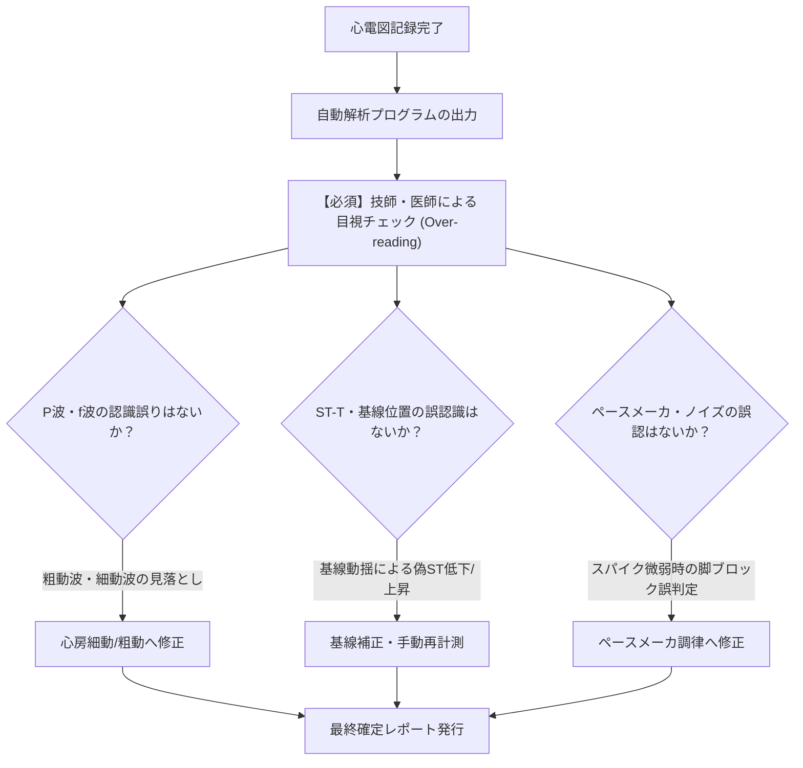
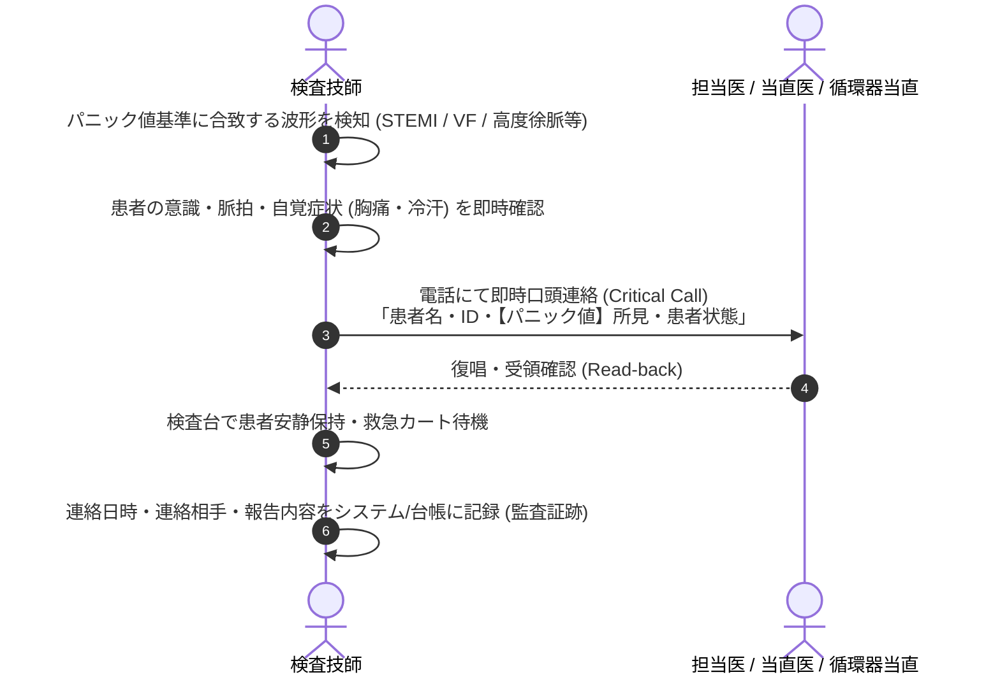

# 13.5 検査後プロセスの品質管理（Post-examination）— 自動解析過信防止・比較読影・パニック値

## 📌 検査後プロセスの3本柱

心電図波形を記録し終えた後の品質管理（Post-examination）において、医療事故を未然に防ぐための最重要ステップは以下の3点です。

1. **自動解析（コンピュータ診断）の盲点・誤判定の修正**
2. **過去心電図との比較読影（Previous Comparison）の徹底**
3. **パニック値（Critical Values / Critical Call）の即時医師連絡**

---

## 🤖 1. 心電図自動解析（コンピュータ判定）の盲点と過信防止

現代の心電計に搭載されている自動解析アルゴリズムは極めて高精度ですが、**「過信は禁物」であり、必ず人間（臨床検査技師・医師）による目視照合（オーバーリード）が必須**です。

### 自動解析の代表的誤認識パターン一覧

| 自動解析の誤出力 | 実際の波形・真の病態 | なぜコンピュータが誤認するのか（機序） |
| :--- | :--- | :--- |
| **「正常洞調律（Normal Sinus）」** | **心房細動（AF）または心房粗動（AFL）** | ・粗動波（F波）を正常P波としてカウント ・f波の電位が小さくRR間隔の軽度不整を洞性不整脈と判定 |
| **「洞性徐脈」「房室ブロック」** | **上室期外収縮の非伝導（Blocked PAC）** | ・T波の中に先行P'波が埋もれているのを検出できず、洞停止や房室ブロックと誤判定 |
| **「完全左脚ブロック（CLBBB）」** | **右室心尖部ペーシング波形** | ・極小ペーシングパルス（バイポーラ等）を検出できず、自己の脚ブロックと判定 |
| **「心室頻拍（VT）」「心室細動（VF）」** | **筋電図・歯磨き・振戦アーチファクト** | ・高頻度のギザギザノイズをQRS-T波の連続と誤認識 |
| **「前壁中隔梗塞（QS in V1-V3）」** | **電極の高位装着（第2/3肋間）または肢誘導逆** | ・手技的ミスによる陰性P/QS波を病的心筋壊死と判定 |
| **「虚血性ST低下」「ST上昇」** | **基線動揺（呼吸性うねり）** | ・基線の上下動により、J点・ST点の計測基準線（PRセグメント）がズレる |

---

## 🔍 2. 過去心電図との比較読影（Previous Comparison）

ISO 15189では、過去の検査履歴が存在する場合、**「経時的変化（Change from previous）」**を確認することが推奨されています。

### 比較読影で必ずチェックすべき項目
1. **新規のST-T変化**:
   - 過去に平坦〜陽性T波であった部位が陰転化しているか？（急性虚血・NSTEMIの疑い）
2. **新規の脚ブロック（New-onset LBBB/RBBB）**:
   - 新規出現した完全左脚ブロックはSTEMI等価物として緊急カテ適応。
3. **QRS幅・QTcの経時的延長**:
   - 薬剤性QT延長（TdP発症リスク）の早期警戒。
4. **電気軸の大幅なシフト**:
   - 正常軸から左軸偏位へのシフト（左脚前枝ブロックの新規発症など）。
5. **移行帯の急激な変化**:
   - 肺塞栓（急性右心負荷）に伴う時計回転方向シフト。

---

## 🚨 3. 心電図パニック値（Critical Call）基準と即時連絡プロトコル

臨床検査技師が生理検査室・病棟・外来で心電図を記録した際、**「生命に直結する超緊急所見」を発見した場合は、医師の依頼を待たずに即時報告（Critical Call）**を実施します。

### 心電図パニック値（即時連絡）対象所見一覧表

| 分類 | パニック値対象所見 | 臨床的リスク | 報告基準タイムライン |
| :--- | :--- | :--- | :--- |
| **致死的不整脈** | ・心室細動（VF）/ 心室粗動 ・持続性心室頻拍（VT）/ 多形性VT (TdP) ・無脈性電気活動（PEA）/ 心静止 | 心停止・突然死 | **直ちに（0分）** 院内コード・スタットコール |
| **虚血性緊急事態** | ・ST上昇型心筋梗塞（STEMI: 2誘導以上の有意なST上昇） ・Wellensサイン / de Winterサイン ・広範なST低下 ＋ aVR ST上昇（主幹部病変疑い） ・新出現の完全左脚ブロック（New LBBB） | 急性心筋梗塞 心原性ショック | **5分以内** 主治医・循環器当直へ直電 |
| **重症徐脈・伝導障害** | ・完全房室ブロック（3度AVB） ・高度房室ブロック（Mobitz II型 2:1/3:1） ・心停止（Pause $\ge 3.0\text{ 秒}$） ・著明な徐脈（$\text{HR} < 35\text{ bpm}$ かつ症状あり） | Adams-Stokes発作 心原性失神 | **5分以内** 担当医・主治医へ直電 |
| **電解質・中毒サイン** | ・重症高K血症パターン（テント状T ＋ QRS拡大 ＋ P消失） ・著明なQT延長（$\text{QTc} \ge 500\text{ ms}$） | TdP・心室細動 心停止 | **10分以内** 主治医へ直電・採血確認 |
| **極度の頻脈** | ・発作性上室性頻拍（PSVT: $\text{HR} \ge 160\text{ bpm}$） ・心房細動 / 粗動の著明な頻脈（$\text{HR} \ge 150\text{ bpm}$） | 血行動態破綻 急性心不全 | **15分以内** 担当医へ連絡 |

> [!IMPORTANT]
> ### 監査証跡（Audit Trail）の記録
> ISO 15189では、パニック値連絡を行った場合、以下の4点を必ずレポート・検査情報システム（LIS/HIS）に記録することが要求されます。
> 1. **連絡日時（年月日時分）**
> 2. **報告した医師の氏名**
> 3. **報告した検査技師の氏名**
> 4. **報告内容および医師からの復唱（Read-back）確認の有無**
