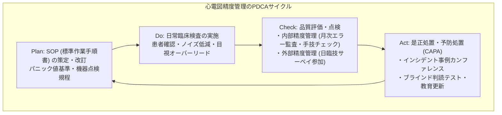

# 13.6 内部・外部精度管理とSOP・継続的教育体制

## 📌 継続的品質改善（PDCAサイクル）の確立

ISO 15189が求める品質マネジメントシステムの真髄は、一度ルールを作って終わりではなく、**「Plan（計画・SOP策定） ➔ Do（検査実施） ➔ Check（内部・外部評価） ➔ Act（是正措置・教育改善）」**のPDCAサイクルを恒常的に回すことにあります。

---

## 🏛️ 1. 標準作業手順書（SOP: Standard Operating Procedure）の管理

心電図検査室には、誰が検査を行っても同一の高い品質が維持できるよう、以下のSOPを常備し、年1回以上の見直し・改訂を行う必要があります。

### 必須の心電図SOP一覧
1. **標準12誘導心電図 測定手順書**:
   - 安静導入、皮膚前処理、電極装着基準（肋間同定・肢誘導配置）、長尺記録基準。
2. **特殊誘導心電図 測定手順書**:
   - 右側胸部誘導（V3R〜V5R）、背部誘導（V7〜V9）、高位肋間誘導（Brugada疑い時）、小児誘導法。
3. **心電計 保守点検・機器管理手順書**:
   - 始業・終業点検手順、1mV校正テスト手順、定期点検スケジュール、故障時対応フロー。
4. **パニック値（緊急時）報告手順書**:
   - 緊急対象所見の定義、連絡先優先順位、伝達事項・復唱確認、記録・監査手順。
5. **感染対策および衛生管理手順書**:
   - 電極・ベッド・コードの消毒手順（アルコール清拭、次亜塩素酸対応）、感染症患者（接触・飛沫感染）対応。

---

## 🌐 2. 外部精度管理調査（サーベイ）への参加と活用

### 1. 日本臨床衛生検査技師会（JAMT）外部精度管理調査
- **目的**: 全国規模での検査技術・波形計測・判読レベルの均一化と客観的評価。
- **調査内容**:
  - **計測問題**: 心拍数、PQ時間、QRS幅、QT時間、電気軸等の計測誤差評価。
  - **判読・所見問題**: 不整脈、虚血、脚ブロック、電解質異常等の診断一致度。
  - **手技・トラブルシューティング問題**: 誤装着波形の鑑別、アーチファクト除去手法。
- **評価とフィードバック**:
  - 評価結果報告書（正答率・自施設偏差値）を受け取り、自施設の弱点を分析。

### 2. 都道府県臨床検査技師会 実地サーベイ / 相互評価
- 地域内の他施設との間で、手技確認（実地監査）や共通症例検討を実施。

---

## 📊 3. 内部精度管理（IQM: Internal Quality Management）

日々の検査室内部で実施する品質管理手法です。

| 内部管理項目 | 実施頻度 | 具体的手法・評価指標 | 改善アクション |
| :--- | :--- | :--- | :--- |
| **手技・電極装着の相互チェック** | 月1回 | 先輩技師・指導者による電極装着部位（肋間・肢誘導）のブラインド監査 | 装着位置のズレ傾向をフィードバック・再指導 |
| **自動解析修正率の集計** | 毎月 | 発行された心電図のうち、技師・医師が自動判定を変更・修正した割合を集計 | 誤判定頻出パターンの室内部会共有 |
| **アーチファクト再検率の集計** | 毎月 | ノイズ（筋電・基線動揺）による再測定件数のモニタリング | 原因（患者指導、室温、電極劣化）の特定と改善 |
| **パニック値報告の監査** | 毎月 | パニック値発生時の「連絡までの所要時間」「記録漏れ」のチェック | 100%の即時報告・記録達成を維持 |

---

## 👥 4. 要員の教育体制と能力評価（Competence Assessment）

ISO 15189では、検査に従事する全要員の力量（Competence）が客観的に評価されていることが必須条件です。

### 1. スキルマップと段階的認定制度
- **レベル1（新人・初級）**: 単独での12誘導記録、日常点検の実施、明らかな電極誤装着・ノイズの回避ができる。
- **レベル2（中級）**: 不整脈・虚血波形の正確な目視チェック、長尺記録の判断、パニック値の即時コールができる。
- **レベル3（上級・指導者）**: 特殊誘導（後壁・右胸部）の自律的追加、複雑心電図の鑑別、外部サーベイ統括、SOP改訂ができる。

### 2. 定期的なブラインド判読テスト
- 過去の難解症例やヒヤリハット症例（誤装着、偽性ST変化、ペースメーカ不全等）を用いた、検査室全員参加の判読テスト（年2回以上）。

### 3. 是正処置・予防処置（CAPA: Corrective Action and Preventive Action）
- インシデント（例：肢誘導逆装着のままレポート発行、パニック値連絡の遅延など）が発生した場合、**「個人の責任追及」ではなく「システムの不備」として根本原因を分析（RCA: Root Cause Analysis）し、手順書改訂やダブルチェック機能の追加を行う**。
