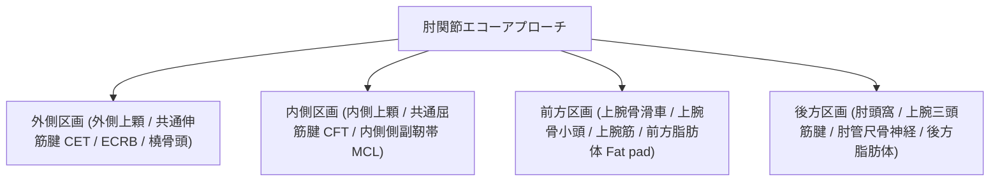

# 肘関節：解剖と標準描出

> [!NOTE] 概要
> 肘関節は外側（テニス肘・共通伸筋腱）、内側（ゴルフ肘・MCL）、前方（関節包・上腕筋・上腕骨滑車・Fat pad）、後方（肘頭・上腕三頭筋腱・肘管尺骨神経）の4アプローチで体系的に評価します。

---

## 1. 肘関節4区画アプローチ

---

## 2. 主要アプローチの解剖標的と描出法

| 区画アプローチ | 主要観察対象 | 解剖学的ランドマーク | 臨床的意義・代表的病態 |
| :--- | :--- | :--- | :--- |
| **前方アプローチ (Anterior)** | ・上腕骨滑車 (Trochlea) ・上腕骨小頭 (Capitellum) ・上腕筋 (Brachialis) ・前方脂肪体 (Anterior fat pad) | ・滑車の砂時計状関節軟骨 ・烏口突起窩 / 橈骨窩 | ・関節水腫（前腕屈曲位でのFat pad隆起・Sail sign） ・上腕二頭筋腱遠位部断裂 ・離断性骨軟骨炎 (OCD) 初期病変 |
| **外側アプローチ (Lateral)** | ・共通伸筋腱 (CET) ・短橈側手根伸筋 (ECRB) ・外側側副靭帯複合体 (LCLC) ・橈骨頭 (Radial head) | ・外側上顆 (Lateral epicondyle) ・腕橈関節裂隙 | ・上腕骨外側上顆炎（テニス肘: CET/ECRB起始部変性・不全断裂） ・橈骨頭骨折・骨輪郭不整 |
| **内側アプローチ (Medial)** | ・共通屈筋腱 (CFT) ・内側側副靭帯 (MCL / UCL 前斜線維) ・内側上顆 (Medial epicondyle) | ・内側上顆と鉤状結節 (Sublime tubercle) を結ぶ靭帯走行 | ・上腕骨内側上顆炎（ゴルフ肘） ・野球肘（MCL断裂・牽引ストレス・裂離骨折・石灰化） ・Valgus stress test時の関節裂隙開大評価 |
| **後方アプローチ (Posterior)** | ・上腕三頭筋腱 (Triceps tendon) ・肘頭 (Olecranon) ・肘頭窩 (Olecranon fossa) ・肘管 (Cubital tunnel: 尺骨神経) | ・肘頭付着部 ・内側上顆後方の尺骨神経溝 | ・肘頭滑液包炎 (Olecranon bursitis) ・肘管症候群（尺骨神経の腫大・扁平化・亜脱臼） ・後方関節水腫（後方Fat padの偏位） |

---

## 3. 描出テクニックと動態評価（Dynamic Evaluation）

1. **内側側副靭帯 (MCL) のストレステスト**:
   - 肘関節屈曲30°〜90°位で外反ストレス（Valgus stress）を加え、腕尺関節裂隙の開大（正常: 1mm未満、靭帯断裂時: 有意な開大）をリアルタイム観察。
2. **肘管尺骨神経の屈伸動態観察**:
   - 肘関節の完全屈曲時に尺骨神経が内側上顆を乗り越えて前方へ脱臼・亜脱臼（Snapping triceps / Ulnar nerve dislocation）しないかを短軸像で確認。

---

