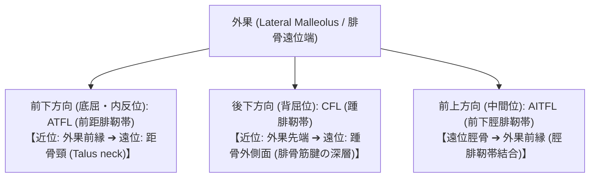

# 足関節・足部：解剖と標準描出

> [!NOTE] 概要
> 足関節外傷で最も損傷頻度の高い**前距腓靭帯（ATFL: 外果 ➔ 距骨頸）**をはじめ、踵腓靭帯（CFL）、前下脛腓靭帯（AITFL）、内側三角靭帯、およびアキレス腱・足底腱膜までを体系的かつ再現性高く描出します。

---

## 1. 足関節外側靭帯群の描出フローと解剖学的ランドマーク

---

## 2. 足関節・足部の主要構造と標準描出手技

| 解剖構造 | 走行・付着部（ランドマーク） | 推奨肢位・描出法 | 臨床的意義・代表疾患 |
| :--- | :--- | :--- | :--- |
| **前距腓靭帯 (ATFL)** | **近位: 外果前縁 ➔ 遠位: 距骨頸（Neck of Talus）** | 足関節軽度底屈・内反位。プローブを外果から前下方（約15〜20°傾斜）に当てる | ・足関節内反捻挫（全靭帯損傷の約80%） ・不全断裂/完全断裂/裂離骨折 ・前方引き出し動態テストでの不安定性 |
| **踵腓靭帯 (CFL)** | 近位: 外果先端 ➔ 遠位: 踵骨外側面（長・短腓骨筋腱の直下） | 足関節軽度背屈位。外果先端から後下方（踵骨方向）へ長軸走査 | ・重度足関節捻挫（ATFL断裂に続発） ・腓骨筋腱脱臼の合併評価 |
| **前下脛腓靭帯 (AITFL)** | 近位: 脛骨前外側（Chaput結節） ➔ 遠位: 腓骨前縁（Wagstaffe結節） | 中間位。外果より約1cm中枢側の前脛腓関節裂隙を斜め水平走査 | ・高位足関節捻挫（Syndesmosis損傷） ・脛腓間離開（ダイナミック外旋テスト） |
| **三角靭帯 (Deltoid Ligament)** | 近位: 内果先端 ➔ 遠位: 舟状骨・距骨・載距突起 | 外反位。内果を中心とした扇状走査 | ・外反捻挫・足関節果部骨折合併 |
| **アキレス腱 (Achilles Tendon)** | 下腿三頭筋（腓腹筋・ヒラメ筋腱膜） ➔ 踵骨隆起後方 | 腹臥位・足部下垂位。矢状断（長軸）および水平断（短軸）で近位〜遠位を全走査 | ・アキレス腱断裂（踵骨付着部上方2〜6cmの無血管野好発） ・アキレス腱周囲炎・付着部症（付着部石灰化・Enthesopathy） |
| **足底腱膜 (Plantar Fascia)** | 近位: 踵骨隆起内側結節 ➔ 遠位: 第1〜5中足骨頭底 | 仰臥位または腹臥位・足趾他動的背屈位（Windlass機構緊張位）。踵骨内側結節付着部を長軸走査 | ・**足底腱膜炎 (Plantar Fasciitis)** （正常厚: $<4.0\text{ mm}$、$\ge 4.0\text{ mm}$ で肥厚・低エコー化、踵骨棘形成） |

---

## 3. 動態評価（Dynamic Ultrasound Examination）

1. **ATFL 前方引き出しテスト（Anterior Drawer Test）**:
   - 距骨と外果を同時に長軸描出しながら、検者が踵骨を前方へ牽引。距骨の前方偏位量（健側対比 $\ge 2\text{ mm}$ または裂隙開大）を客観的ミリ単位で計測。
2. **脛腓間離開テスト（External Rotation Stress Test）**:
   - AITFL描出断面で足関節を他動的に外旋・背屈させ、脛腓骨間距離の離開増大（$\ge 1\text{ mm}$）を評価。

---

