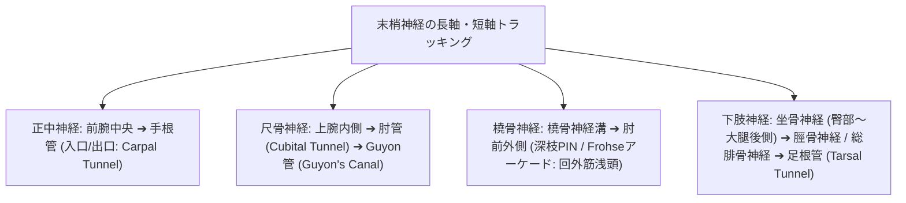

# 末梢神経：解剖と標準描出

> [!IMPORTANT] 神経描出のゴールデンルール
> 運動器超音波における末梢神経の短軸像は、**「蜂の巣状パターン（Honey-comb Appearance）」**（低エコーの神経束 Fascicles が、高エコーの外神経膜・周神経膜 Epineurium に囲まれた構造）として同定します。長軸像では平行に走る層状の線維束パターン（Fascicular architecture）を呈します。

---

## 1. 主要末梢神経のトラッキングマップ

---

## 2. 神経別の解剖指標と主要絞扼部位（Frohseアーケード等）

| 神経名称 | 主要走行ルート | 解剖学的絞扼好発部位（ランドマーク） | 正常断面積基準 (CSA) | 代表的絞扼性神経障害 |
| :--- | :--- | :--- | :--- | :--- |
| **正中神経 (Median Nerve)** | 前腕中央（浅指屈筋と深指屈筋の間） ➔ 手根管 | ・**手根管入口部 (Pisiform level)**: 屈筋支帯下 ・円回内筋（Pronator teres）の2頭間 | 入口部 CSA $\le 10\text{ mm}^2$ （$\ge 12\text{ mm}^2$ でCTS陽性） | **手根管症候群 (CTS)** 円回内筋症候群 前骨間神経麻痺 (AIN) |
| **尺骨神経 (Ulnar Nerve)** | 上腕内側 ➔ 内側上顆後方（尺骨神経溝） ➔ Guyon管 | ・**肘管 (Cubital tunnel)**: Osborne靭帯下 ・**Guyon管**: 豆状骨・有鉤骨鈎間 | 肘管部 CSA $\le 8\sim 9\text{ mm}^2$ （$\ge 10\text{ mm}^2$ で異常） | **肘管症候群 (Cubital Tunnel Syn.)** Guyon管症候群（尺骨神経管症候群） |
| **橈骨神経 (Radial Nerve)** | 上腕骨後面（橈骨神経溝） ➔ 腕橈骨筋と上腕筋の間 ➔ 浅枝・深枝（後骨間神経: PIN）に分岐 | ・**Frohseのアーケード (Arcade of Frohse)**: **回外筋浅頭（Supinator muscle superficial head）**の近位腱性縁膜 ・橈骨神経管（Radial tunnel） | PIN CSA $\le 2\sim 3\text{ mm}^2$ | **後骨間神経麻痺 (PIN麻痺)** 橈骨管症候群 (Radial Tunnel Syn.) ハネムーン麻痺（下垂手） |
| **総腓骨神経 (Common Peroneal N.)** | 大腿二頭筋内側縁 ➔ 腓骨頭・腓骨頸後外側 | ・**腓骨頸（Fibula neck）部**: 浅層走行部 ・長腓骨筋起始部 | 腓骨頭部 CSA $\le 12\text{ mm}^2$ | **総腓骨神経麻痺**（下垂足: Drop foot、足背感覚障害） |
| **脛骨神経 (Tibial Nerve)** | 膝窩 ➔ ヒラメ筋腱弓 ➔ 下腿深屈筋間 ➔ 内果後方 | ・**足根管 (Tarsal tunnel)**: 屈筋支帯下（内果後下方） | 内果部 CSA $\le 12\sim 14\text{ mm}^2$ | **足根管症候群 (Tarsal Tunnel Syn.)** |

---

## 3. 神経エコーの診断評価ポイント

1. **神経腫大（CSA計測）**:
   - 絞扼部位の直前（近位部）における断面積（Cross-Sectional Area: CSA）の著明な増大（Spindle swelling）。
2. **低エコー化・神経束パターン消失**:
   - 正常な高エコー外膜・束状構造が失われ、浮腫状の均一な低エコー域を呈する。
3. **Power Doppler / Microvascular Flow による血流増生**:
   - 活動性炎症・うっ血を反映する神経内血流シグナル（Intraneural hypervascularity）の出現。

---

