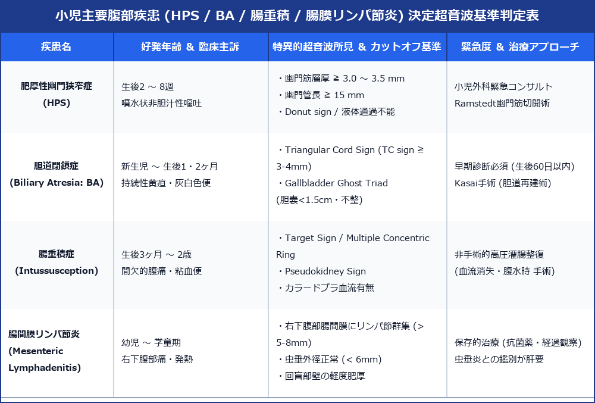

# 小児腹部超音波疾患 完全診断プロトコル (HPS / 胆道閉鎖症 BA / 腸重積症 / 腸間膜リンパ節炎)

> [!NOTE] 概要
> 小児腹部超音波検査は、放射線被曝がなく鎮静を必要としない第一選択の診断モダリティです。特に**肥厚性幽門狭窄症 (HPS)**、**胆道閉鎖症 (Biliary Atresia: BA)**、**腸重積症**、**腸間膜リンパ節炎**は、成人と異なる特異的な計測カットオフ値および超音波サインに基づく緊急判定が求められます。

---

## 1. 小児消化管 ＆ 黄疸疾患 超音波決定マトリックス

---

## 2. 肥厚性幽門狭窄症 (Hypertrophic Pyloric Stenosis: HPS)

### 1) 疾患概念 ＆ 臨床症状
生後 2～8 週（ピーク 3～5 週）の乳児に発生。幽門輪状筋が高度に肥厚し、胃出口部が閉塞。**噴水状の非胆汁性吐乳・嘔吐**が特徴。

### 2) 超音波計測基準 (JSUM 小児超音波ガイドライン)
- **幽門筋層厚 (Pyloric Muscle Thickness)**: **≧ 3.0 ～ 3.5 mm** (最も感度・特異度が高い)
- **幽門管長 (Pyloric Channel Length)**: **≧ 15 mm**
- **幽門外径 (Pyloric Diameter)**: **≧ 10 ～ 14 mm**
- **特異的サイン**:
  - **Donut Sign / Target Sign**: 幽門短軸像での肥厚筋層（低エコー）と粘膜（高エコー）の二層構造。
  - **Cervix Sign**: 幽門長軸像で子宮頸部に類似した形態。
  - **開動性消失**: 観察中、幽門管が一切開大せず、胃内容物が十二指腸へ通過不能。

---

## 3. 胆道閉鎖症 (Biliary Atresia: BA)

### 1) 早期診断の重要性
生後 60 日以内の早期 Kasai 手術（胆道再建術）が予後を決定するため、新生児・乳児の持続性黄疸・灰白色便に対する超音波スクリーニングが必須。

### 2) 超音波 3大判定サイン
- **Triangular Cord Sign (TC Sign)**:
  - 門脈左右分岐部前方の線維性残基。高エコー線条影の厚み **≧ 3.0 ～ 4.0 mm** で陽性。
- **Gallbladder Ghost Triad (胆嚢所見)**:
  - ① 胆嚢長径 **＜ 1.5 cm**（小胆嚢）
  - ② 胆嚢壁輪郭が不整・微小
  - ③ 哺乳後収縮能の消失・壁描出不良
- **肝門部リンパ節肥大 ＆ 肝外胆管描出不能**

---

## 4. 腸間膜リンパ節炎 vs 急性虫垂炎の小児鑑別

- **腸間膜リンパ節炎 (Mesenteric Lymphadenitis)**:
  - 右下腹部・回盲部周囲に**短径 5～8 mm 以上の紡錘形リンパ節が3個以上群集**。
  - **虫垂は正常（外径 ＜ 6.0 mm）**。回腸末端壁の軽度肥厚を伴う。
- **小児急性虫垂炎 (Appendicitis)**:
  - 虫垂外径 **＞ 6.0 mm**、糞石 (Appendicolith) 描出、虫垂周囲脂肪織の高エコー化 (Inflamed Fat Sign)。

---

## 5. レポート記載例

`
【超音波所見】
上腹部走査：
幽門管長軸像および短軸像にて、幽門筋層の高度な肥厚を認める。
・幽門筋層厚: 4.2 mm（異常: ≧ 3.0-3.5 mm）
・幽門管長: 17.5 mm（異常: ≧ 15 mm）
観察時間中、幽門管の開動性は認められず、胃蠕動に伴う胃内容物の通過障害を認める。Donut sign 陽性。
胆嚢・肝実質に異常なし。

【印象】
肥厚性幽門狭窄症 (Hypertrophic Pyloric Stenosis: HPS)。
小児外科緊急コンサルトを推奨。
`
