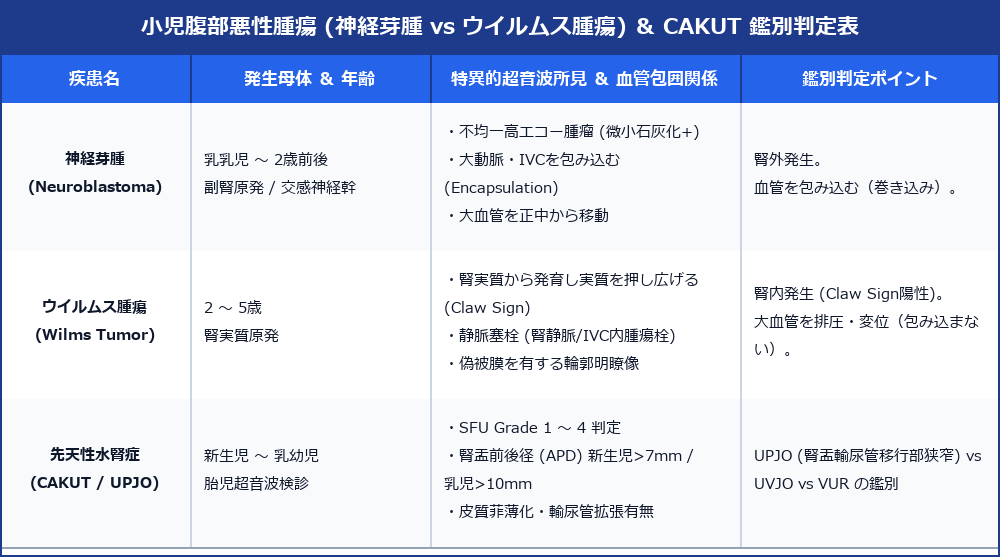

# 小児腹部悪性腫瘍 (神経芽腫 vs ウイルムス腫瘍) ＆ CAKUT 完全判定プロトコル

> [!NOTE] 概要
> 小児の腹部腫瘤および先天性尿路異常は、成人とは全く異なる特異的な腫瘍発生機序と解剖学的分類を保ちます。特に小児2大腹部悪性腫瘍である **神経芽腫 (Neuroblastoma)** と **ウイルムス腫瘍 (Wilms Tumor / 腎芽腫)** の鑑別、および **先天性腎尿路異常 (CAKUT)** の SFU 分類評価は小児超音波の極めて重要な臨床領域です。

---

## 1. 小児腹部腫瘍 ＆ CAKUT 超音波鑑別マトリックス

---

## 2. 神経芽腫 (Neuroblastoma) vs ウイルムス腫瘍 (Wilms Tumor)

### 1) 神経芽腫 (Neuroblastoma)
- **発生**: 副腎髄質または交感神経幹。乳児～2歳に最多。
- **解剖学的特徴 (Encapsulation)**:
  - **腎外発生**: 腎臓を外側・下方に押し出す。
  - **大血管包囲**: 腹部大動脈 (Ao) や下腔静脈 (IVC) を**包み込むように浸潤・包囲 (Encapsulate)** し、正中線を超えて対側へ移動させる。
- **エコー像**: 不均一な高エコー腫瘤。**微小石灰化（音響陰影）を高頻度に伴う**。

### 2) ウイルムス腫瘍 (Wilms Tumor / 腎芽腫)
- **発生**: 腎実質原発。2～5歳に最多。
- **解剖学的特徴 (Claw Sign)**:
  - **腎内発生**: 腫瘍が腎実質から発育するため、正常腎実質が腫瘍の縁を爪のように包む **Claw Sign (爪像)** が陽性。
  - **大血管排圧**: 大動脈やIVCを**押し退ける（排圧・変位）**が、包み込むことはない。
- **静脈塞栓**: 腎静脈および下腔静脈 (IVC) 内に腫瘍栓 (Tumor Thrombus) を伸ばしやすい。

---

## 3. 先天性腎尿路異常 (CAKUT / UPJO) ＆ SFU 分類

### 1) 評価基準 (SFU: Society for Fetal Urology Grade)
- **Grade 1**: 腎盂の軽度拡張のみ
- **Grade 2**: 腎盂拡張 ＋ 数個の腎杯拡張
- **Grade 3**: 全腎杯の均一な拡張（腎実質厚は正常維持）
- **Grade 4**: 全腎杯拡張 ＋ **腎実質の皮質菲薄化**

### 2) 腎盂前後径 (APD: Anterior-Posterior Diameter)
- 新生児: **APD ＞ 7 mm** で有意な水腎症
- 乳児: **APD ＞ 10 mm** で精査・UPJO (腎盂輸尿管移行部狭窄) 疑い

---

## 4. レポート記載例

`
【超音波所見】
右後腹膜像：
右副腎領域に 58 × 45 mm 大の境界不整・内部不均一な高エコー腫瘤を認める。
腫瘤内部に点状高エコー（微小石灰化）を複数伴う。
腫瘤は腹部大動脈および下腔静脈を包み込むように包囲 (Encapsulate) し、右腎を下外方に変位させている。
Claw sign 陰性。右腎実質自体に直接の発生なし。

【印象】
右副腎原発の神経芽腫 (Neuroblastoma) を第一に考慮。
小児腫瘍科・小児外科への緊密なコンサルトを推奨。
`
