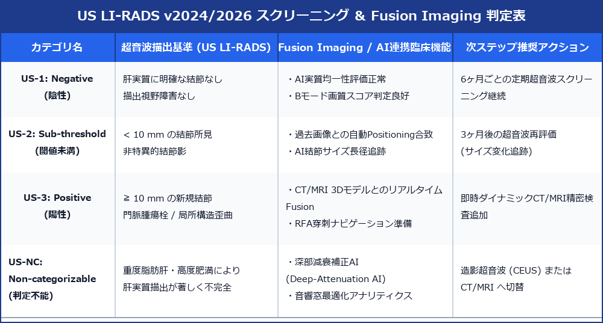

# US LI-RADS v2024/2026 ＆ Fusion Imaging / AI腹部超音波ガイドライン

> [!NOTE] 概要
> 腹部超音波分野では、米国放射線学会 (ACR) による **US LI-RADS (Ultrasound Liver Imaging Reporting and Data System)** の世界基準化、CT/MRI 3D画像とリアルタイム超音波を同期させる **Fusion Imaging (画像融合手技)**、および深層学習を用いた **AI超音波診断支援** が臨床の第一線で急速に標準化されています。

---

## 1. US LI-RADS 判定 ＆ Fusion/AI 臨床活用マトリックス

---

## 2. US LI-RADS 概念 ＆ 判定アルゴリズム

### 1) 分類基準
肝硬変・HBV/HCV持続感染などの HCC 高リスク群におけるスクリーニング品質を厳格規定。
- **US-1: Negative (陰性)**: 肝実質に結節性病変なし、または明確な良性病変（嚢胞・典型的高エコー血管腫）のみ。6ヶ月ごとの定期超音波。
- **US-2: Sub-threshold (閾値未満)**: **長径 ＜ 10 mm** の境界不明瞭結節・新規非特異的エコー。3ヶ月後の超音波再評価。
- **US-3: Positive (陽性)**: **長径 ≧ 10 mm の新規結節**、または門脈腫瘍栓 (Vp)。ダイナミックCT/MRI精密検査を推奨。
- **US-NC: Non-categorizable (判定不能)**: 重度脂肪肝や深部減衰により、肝実質の 50% 以上が観察不能。造影超音波 (CEUS) または CT/MRI へ切替。

---

## 3. Fusion Imaging (画像融合) ＆ 治療ナビゲーション

- **原理**: 電磁波センサー等を用い、DICOMデータ（CT/MRI 3D再構成像）と超音波プローブの位置情報を同期。超音波画面上に同断面のCT/MRI画像をリアルタイム並列描出。
- **臨床適応**:
  - **Bモード非描出 HCC の同定**: Bモードで脂肪肝等に埋もれて視認不能な小さなHCCを、CT/MRIの血管構造から正確に特定。
  - **RFA (ラジオ波焼灼術) 穿刺ナビゲーション**: 腫瘍中心部への正確な針先誘導および焼灼マージン（5mm以上）の即時評価。

---

## 4. AI 腹部超音波診断支援システム (Ultrasound AI)

- **AI 脂肪肝定量アナリティクス**: 肝腎コントラストおよび音響減衰率を画像認識モデルがリアルタイム自動解析し、数値化。
- **AI 結節検出 ＆ 自動計測**: 肝・腎・胆嚢の微小病変を自動バウンディングボックス提示し、最大径をミリ単位で自動スナップ。

---

## 5. レポート記載例

`
【超音波所見】
肝スクリーニング (US LI-RADS 適用)：
肝右葉 S6 肋間像にて、長径 14 mm のやや低エコーを呈する境界明瞭な新規結節影を認める。
Fusion Imaging (前月腹部ダイナミックCT同期) にて、CT早期相高染部位と完全に一致。
US LI-RADS 分類: US-3 (Positive)。

【印象】
S6 肝細胞がん (HCC) 疑い (US-3)。
確定診断および治療方針決定のため、即時ダイナミックMRI (EOB-MRI) 精査を追加してください。
`
