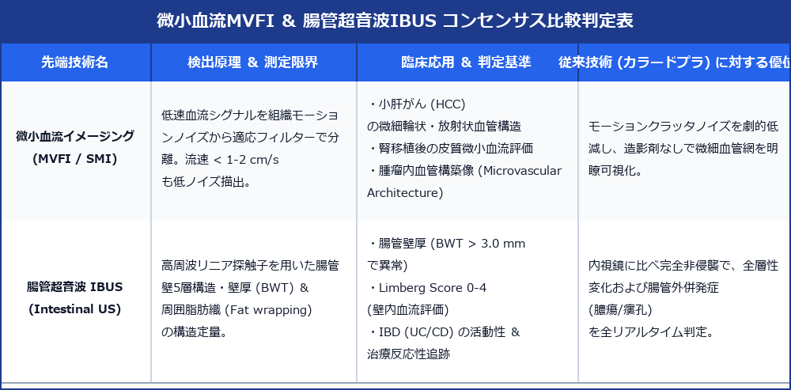

# 微小血流イメージング (MVFI / SMI) ＆ 腸管超音波 (IUS / IBUS) 先端ガイドライン

> [!NOTE] 概要
> 従来のカラードプラの限界（モーションクラッタノイズおよび低流速血流の感度不足）を克服した **微小血流イメージング (MVFI / SMI)** と、国際コンセンサス (IBUS) により炎症性腸疾患 (IBD: 潰瘍性大腸炎・クローン病) の全層評価ツールとして定着した **腸管超音波 (Intestinal Ultrasound: IUS)** は、現代腹部超音波の極めて重要な先端臨床技術です。

---

## 1. MVFI ＆ 腸管超音波 (IUS) 先端コンセンサスマトリックス

---

## 2. 微小血流イメージング (MVFI / SMI / Superb Microvascular Imaging)

### 1) 技術原理
独自の適応フィルタリング技術により、呼吸や体動に伴う低周波組織運動ノイズ（クラッタ）を除去し、**流速 ＜ 1 ～ 2 cm/s の極低速・微小血管シグナル** のみをリアルタイムに高解像度描出。

### 2) 臨床的有用性
- **小肝がん (HCC) 鑑別**: 造影剤を使用せずに、腫瘍内部の微細放射状血管 (Radial vascularity) や微細 Basket pattern を同定。
- **腎移植評価**: 腎皮質最末梢の微小葉間動脈血流を視認し、急性拒絶反応・微小血管炎に伴う皮質灌流低下を即時診断。
- **胆嚢ポリープ vs 胆嚢がん**: 10mm 以下のポリープ性病変における茎部微小血管の有無を判定。

---

## 3. 腸管超音波 (Intestinal Ultrasound: IUS / IBUS)

### 1) 国際 IBUS (International Bowel Ultrasound) 観察プロトコル
高周波リニア探触子（7.5～12.0 MHz）を用いたグラデーション段階圧迫走査。
- **壁厚 (Bowel Wall Thickness: BWT)**: 全層厚 **＞ 3.0 mm** を壁肥厚（異常）と定義。
- **Limberg Score (ドプラ血流評価)**:
  - **Score 0**: 血流シグナルなし（正常/寛解期）
  - **Score 1**: 軽度血流シグナル（点状）
  - **Score 2**: 中等度血流シグナル（線状）
  - **Score 3**: 高度血流シグナル（壁内密に増加：活動性炎症）
- **周囲脂肪織増生 (Fat Wrapping / Creeping Fat)**: 腸管周囲脂肪織が層構造を失い、均一な高エコー帯として拡張。
- **腸管エラストグラフィ**: 壁硬度の測定により、炎症性狭窄（柔らかい） vs **線維性狭窄（硬い: 手術適応）** を非侵襲的に鑑別。

---

## 4. レポート記載例

`
【超音波所見】
回盲部～升状結腸走査 (高周波リニア IUS モード)：
終末回腸壁に全周性の著明な壁肥厚を認める。
・全層壁厚 (BWT): 5.8 mm（正常: < 3.0 mm）
・層構造: 粘膜下層の浮腫状拡大を伴い壁構造は保持。
・MVFI / カラードプラ: 壁内に豊富な線状血流シグナルを認める（Limberg Score 3: 高度活動性）。
・周囲所見: Creeping fat 像陽性。小瘻孔および網膜リンパ節腫脹を伴う。

【印象】
クローン病 (Crohn's Disease: CD) 終末回腸型。高度な全層性活動性炎症を呈する。
`
